# Lab 1 — Install, Connect and Verify

**Day:** 1 — Module 2, Installation and Setup  
**Deck:** `decks/pptx_new/MongoDB_Module02_Installation_and_Setup.pptx` — slide 48, "Lab 1 — Install, Connect and Verify" (the official lab that closes Module 2)  
**Time:** 40 minutes  
**Difficulty:** Beginner

**Objective:** Provision MongoDB on one path, connect with `mongosh` (and Compass), create `training_store`, and prove the environment: ping, insert, find, update and delete.

Fill in [Exercise 2.4 — Environment Readiness Checklist](../exercises/exercise-2.4-environment-readiness-checklist.md) as you go.

---

## What you will finish with

- A MongoDB server or cluster you are allowed to use (Path A, B or C)
- A `mongosh` session that returns `{ ok: 1 }` to a ping
- `training_store.environment_check` with a **READY** document carrying your name, three component documents and a **COMPLETE** validation document
- Proof of all four CRUD operations with the probe product `LAB1` — and `LAB1` deleted again
- The same document visible in Compass
- An honest Exercise 2.4 checklist, with no password written anywhere

Module 3's Lab 2 starts from this state.

---

## Knowledge you need (from Module 2)

| Module 2 idea | How it appears in this lab |
| --- | --- |
| **mongod vs mongosh** | Step 3 checks the server; Step 4 starts the client. Closing `mongosh` never stops `mongod`. |
| **Connection string** | Step 4: `mongodb://localhost:27017` locally; `mongodb+srv://…` for Atlas. |
| **Let mongosh prompt** | Paths B and C pass `--username`; `mongosh` asks for the password, so it never lands in history. |
| **Ping proves reachability, not access** | Step 5 pings; Steps 7–9 prove you can write and read. |
| **`use` creates nothing** | Step 6: `training_store` appears in `show dbs` only after the first write. |
| **Troubleshoot by layer** | Process → port and bindIp → credentials → network and TLS ([Exercise 2.3](../exercises/exercise-2.3-diagnose-connection-failures.md)). |

---

## Before you start

**Environment:** Windows 10/11 with PowerShell (in VS Code/Cursor: ``Ctrl+` ``). The commands below are PowerShell.

> **macOS / Linux (bash or zsh):** the `mongosh` commands are identical. Where a PowerShell command ends a line with a backtick `` ` ``, use a backslash `\` instead. Service commands for each OS are in Step 2.

| Task | How |
| --- | --- |
| Terminal | ``Ctrl+` `` → PowerShell (bottom panel) |
| MongoDB shell | `mongosh`, in the same terminal. Commands after the `test>` or `training_store>` prompt run **inside** `mongosh`. |
| Leave `mongosh` | `exit` (the server keeps running) |
| Compass | Desktop app, Start menu |
| Course folder | Open the course repository folder so `.\datasets\...` paths work |

**Security rules for the whole lab**

- Use placeholders in notes: `<connection-string>`, `<username>`, `<password>`. Never write a real password into a file, chat, slide or screenshot.
- Store the real URI in a password manager or an environment variable. Let `mongosh` and Compass **prompt** for the password.
- Keep a local server on `127.0.0.1` / `localhost`. **Do not** set `bindIp: 0.0.0.0` or add `0.0.0.0/0` to an Atlas access list to "make it work" — either one exposes the database to every network.

---

## Step 1 — Choose your deployment path

**Do this:** Confirm with the instructor which **one** path you will complete, and write it on your Exercise 2.4 checklist.

| Path | What it is |
| --- | --- |
| **A** | Local MongoDB Community Edition on your machine (or a local Docker container) |
| **B** | Managed cloud — a MongoDB Atlas cluster |
| **C** | An instructor-provided connection string |

**Expected result:** You know which path you will complete. Neighbours may use a different path; from Step 4 onward the `mongosh` commands are the same.

---

## Step 2 — Install or provision MongoDB

**Do this:** Complete only your path.

### Path A — Local installation

Follow MongoDB's official install page for your OS and version.

**Windows:** follow the same order as [Windows lab setup](../../WINDOWS-LAB-SETUP.md). These screens are from Community Server **8.3.11**, Compass opened by that installer, `mongosh` **2.12.0**, and Database Tools **100.19.0**. A current 8.x server build is fine, and the folder name uses that version. Choose **Complete**, install the service as **Network Service** with the name `MongoDB`, and leave **Install MongoDB Compass** checked. The installer does not include `mongosh` or Database Tools. Configuration file: `C:\Program Files\MongoDB\Server\<version>\bin\mongod.cfg`. Log: `...\Server\<version>\log\mongod.log`.

**Server**

1. On the download page, select the current 8.x version, **Windows x64**, package **msi**, then **Download**.


2. Choose **Complete**. The note on this screen says the shell is a separate install.


3. Leave **Install MongoD as a Service** checked and **Run service as Network Service user** selected. Service name `MongoDB`. Accept the data and log folders. Do not type an account password. Click **Next**.


4. Leave **Install MongoDB Compass** checked. Click **Next**.


5. Click **Install**.


6. Wait until the wizard finishes. Do not click **Cancel**.


7. Click **Finish**. The installer opens Compass.


**Compass** — connect it before you install the shell.

1. If a welcome dialog appears, click **Start**.


2. Click **+ Add new connection**. Leave the URI as `mongodb://localhost:27017` (Compass may add a trailing slash). Do not type a username or password. Click **Save & Connect**.


3. The sidebar lists `localhost:27017` with `admin`, `config`, and `local`. `training_store` appears after Step 7 of this lab.


**MongoDB Shell** — its own MSI. Do not use the zip.

1. On the [Shell download page](https://www.mongodb.com/try/download/shell), choose the current version (this screen shows **2.12.0**), **Windows x64 (10+)**, package **msi**, then **Download**.


2. Run the MSI and click **Next**.


3. If a license page appears, accept it and click **Next**. On **Destination Folder**, leave the folder the wizard shows and leave **Install just for you** checked. Click **Next**.


4. Click **Install**.


5. Click **Finish**. Close any PowerShell window that was already open, then open a new one.


**Database Tools** — a separate MSI. Day 3 Lab 7 needs `mongodump` and `mongorestore`. This installer does not add them to PATH.

1. On the [Database Tools download page](https://www.mongodb.com/try/download/database-tools), choose the current **100.x** (this screen shows **100.19.0**), platform **Windows x86_64**, package **msi**, then **Download**.


2. Run the MSI and click **Next**.


3. Check **I accept the terms in the License Agreement**, then click **Next**.


4. On **Custom Setup**, leave **MongoDB Tools 100** selected and accept `C:\Program Files\MongoDB\Tools\100\`. Click **Next**. Do not click **Cancel** while it installs.


5. Click **Finish**.


6. Add `C:\Program Files\MongoDB\Tools\100\bin` to your user **Path**: Start → “environment variables” → **Edit environment variables for your account** → **Path** → **Edit** → **New** → paste that folder → **OK** on both dialogs. The new line is the last entry. The line above it is the `mongosh` folder. Leave every other line as it is.


7. Close any PowerShell window that was already open. That window still has the old Path, so `mongosh`, `mongodump`, and `mongorestore` all fail there.


In a new window, if `mongodump` is still not recognized, reload the saved Path. An Administrator window can see the new Path first. Sign out and back in so later normal windows do not need the reload line.

```powershell
$env:Path = [Environment]::GetEnvironmentVariable("Path","Machine") + ";" + [Environment]::GetEnvironmentVariable("Path","User")
mongosh --version
mongodump --version
mongorestore --version
```


```powershell
Get-Service MongoDB
mongosh --version
mongodump --version
mongorestore --version
mongosh "mongodb://localhost:27017" --eval "db.runCommand({ ping: 1 })"
```

Expected: service `Running`, `mongosh` **2.12.0**, Database Tools **100.19.0**, and `{ ok: 1 }`. These commands work from any folder. An Administrator window is required only if the service is `Stopped`.


**macOS (Homebrew):**

```bash
brew tap mongodb/brew
brew install mongodb-community
brew services start mongodb-community
mongosh --version
```

**Linux:** add MongoDB's official repository for your distribution (not the distribution's default package), install `mongodb-org`, then:

```bash
sudo systemctl start mongod
sudo systemctl status mongod
sudo systemctl enable mongod
```

**Docker instead of an install (optional):** publish the port on `127.0.0.1` only, and mount a named volume so the data survives:

```powershell
docker run -d --name mongo `
  -p 127.0.0.1:27017:27017 `
  -v mongo-data:/data/db `
  mongodb/mongodb-community-server
```

Check the configuration (`mongod.cfg` on Windows, `/etc/mongod.conf` on Linux): `net.port: 27017` and `net.bindIp: 127.0.0.1`. Leave `bindIp` on localhost — access control is off by default on a local install, which is tolerable only while the server is private to your machine.

### Path B — Managed cloud (Atlas)

1. Sign in to the assigned Atlas project.
2. Create or open the training cluster.
3. **Database Access:** create a least-privilege training database user (for example `readWrite` on `training_store`). Record the **username only** on your checklist. Do not reuse your Atlas login.
4. **Network Access:** add **your current IP address** (or the classroom range the instructor gives you). Never `0.0.0.0/0`.
5. **Connect → Shell:** copy the `mongodb+srv://` connection string and store it securely — for example in an environment variable for this terminal session, **without** the password:

```powershell
$env:MONGODB_URI = "mongodb+srv://<cluster-host>/"
```

(bash: `export MONGODB_URI="mongodb+srv://<cluster-host>/"`)

### Path C — Instructor-provided environment

1. Receive the connection string and temporary credentials through the secure channel the instructor names (not chat).
2. Confirm you are on the allowed network.
3. Store the URI as in Path B, step 5. Do not share it.

**Expected result:** A MongoDB server or cluster exists that you are allowed to use. You have not written a password into any file.

---

## Step 3 — Confirm the server is reachable

**Do this:**

- **Path A (Windows):**

  ```powershell
  Get-Service MongoDB
  Test-NetConnection localhost -Port 27017
  ```

  If the status is `Stopped`, start it in an **Administrator** PowerShell: `Start-Service MongoDB`. (macOS: `brew services list`; Linux: `sudo systemctl status mongod`.)


- **Path B / C:** confirm the Atlas UI (or the instructor) shows the cluster as available.

Record the host and port on your checklist (local default: `localhost:27017`).

**Expected result:** `Status: Running` and `TcpTestSucceeded : True` for a local server, or the cluster shows as available. You know the host and port you will connect to.

On Windows, `Test-NetConnection` may warn that `::1 : 27017` failed. `::1` is IPv6. With `bindIp: 127.0.0.1`, only the IPv4 result counts. `RemoteAddress : 127.0.0.1` and `TcpTestSucceeded : True` means the port is open.

---

## Step 4 — Connect using `mongosh`

**Do this:**

Path A (local, no authentication):

```powershell
mongosh "mongodb://localhost:27017"
```

(`mongosh` on its own connects to the same default address.)

Path B / C (let `mongosh` prompt for the password):

```powershell
mongosh $env:MONGODB_URI --username <username>
```

```text
Enter password: ********
```

(bash: `mongosh "$MONGODB_URI" --username <username>`)

**Expected result:** The shell prompt appears (`test>` locally, or `Atlas atlas-… [primary] test>` on Atlas). This install prints `Using MongoDB: 8.3.11` and `Using Mongosh: 2.12.0`. A yellow startup warning says access control is not enabled. That is expected on this local server: it listens on `127.0.0.1` only, and the labs do not turn authentication on. Do not enable access control to clear the warning. If you see connection refused, a timeout or authentication failed, use the Troubleshooting table at the end — one change at a time.

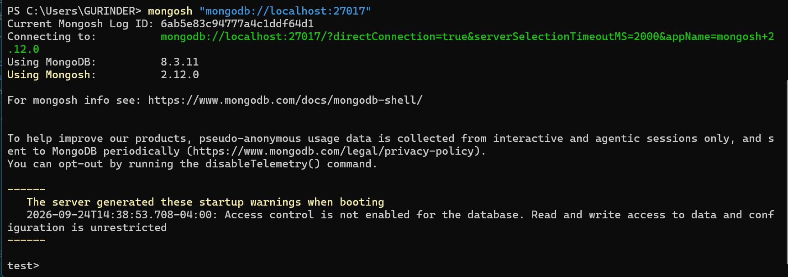

---

## Step 5 — Ping and inspect the environment

**Do this:** At the `mongosh` prompt, press Enter after each line. Do not paste the five lines together. `show` is a shell helper, not JavaScript. A multi-line paste stops with `SyntaxError: Missing semicolon` on `show dbs`, and none of the commands run.

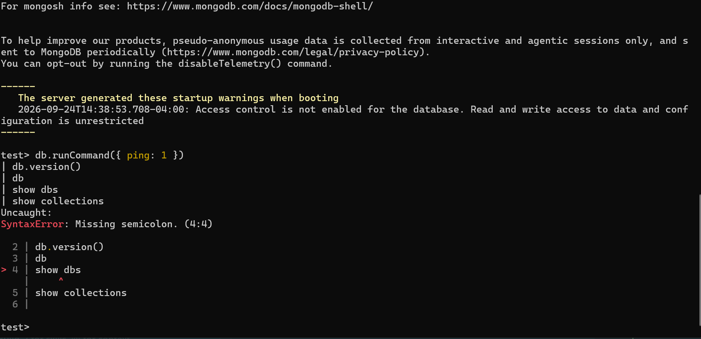

```javascript
db.runCommand({ ping: 1 })
```

```javascript
db.version()
```

```javascript
db
```

```javascript
show dbs
```

```javascript
show collections
```

**Expected result:**

- `{ ok: 1 }` — the server is reachable and answering. This does **not** yet prove you can write.
- `db.version()` prints your server version (this install is **8.3.11**; another 8.x build is fine).
- `db` prints `test`, the default database.
- On a **brand-new server**, `show dbs` lists only `admin`, `config` and `local`. (On Atlas you may see only databases you are allowed to see. On an instructor server where `training_store` is already loaded, it appears too.)
- `show collections` prints nothing — `test` is empty.

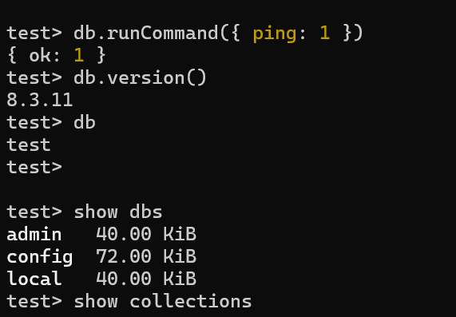

Tick "Ping returns `ok: 1`" on your checklist.

---

## Step 6 — Select `training_store` and create a collection

**Do this:** Press Enter after each line. `use` and `show` are shell helpers, the same as in Step 5. Pasting the block together stops with a syntax error.

```javascript
use training_store
```

```javascript
db.createCollection("environment_check")
```

```javascript
show collections
```

```javascript
db
```

**Expected result:**

- `switched to db training_store`, and the prompt becomes `training_store>`. `use` alone creates nothing on disk.
- `createCollection` returns `{ ok: 1 }`. If you are repeating the lab and it reports **Collection already exists**, that is fine — skip it and continue.
- `show collections` lists `environment_check` (plus `customers`, `orders`, `products` and `reviews` if `training_store` was already loaded).
- `db` prints `training_store`.

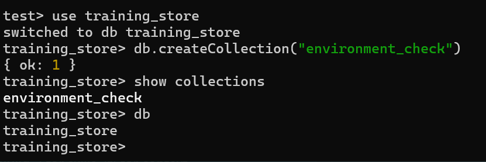

---

## Step 7 — Insert and retrieve a test document

**Do this:**

```javascript
db.environment_check.insertOne({
  participant: "Student",
  environment: "training",
  shellConnected: true,
  status: "READY",
  checkedAt: new Date()
})

db.environment_check.findOne({
  status: "READY"
})
```

**Expected result:**

- The insert returns `{ acknowledged: true, insertedId: ObjectId('…') }` — MongoDB added an `_id` because you didn't supply one.
- `findOne` returns the same document, now including `_id`, with `checkedAt: ISODate('…')` — a real BSON date, not a string.

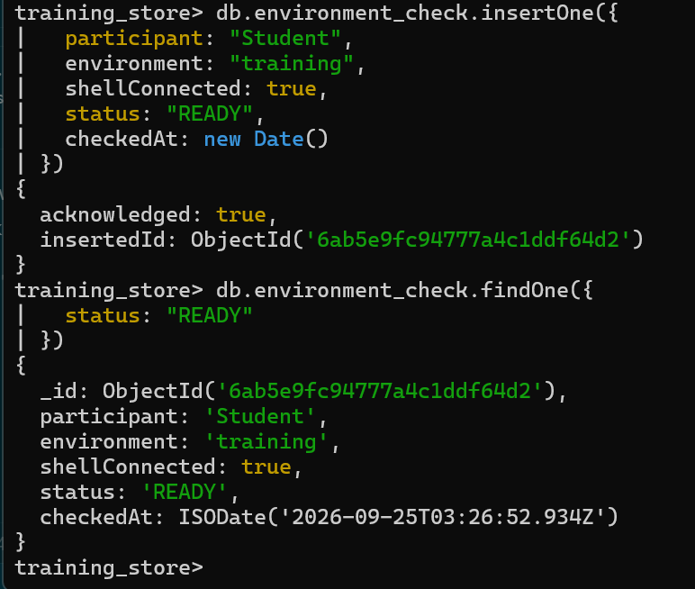

Tick "Test insert" and "Test read" on your checklist.

---

## Step 8 — Insert several documents, count, and update

**Do this:** Replace `Participant Name` with your own name.

```javascript
db.environment_check.insertMany([
  { component: "MongoDB Server", available: true },
  { component: "MongoDB Shell", available: true },
  { component: "MongoDB Compass", available: true }
])

db.environment_check.countDocuments({})

db.environment_check.updateOne(
  { participant: "Student" },
  { $set: { participant: "Participant Name" } }
)

db.environment_check.findOne({ status: "READY" })
```

**Expected result:**

- `insertMany` returns three `insertedIds`.
- `countDocuments({})` returns **4** on a first run (the READY document plus three components; more if you repeated earlier steps).
- `updateOne` returns `matchedCount: 1, modifiedCount: 1`. `insertedId: null` and `upsertedCount: 0` mean this update did not insert a new document.
- The READY document now shows your name.

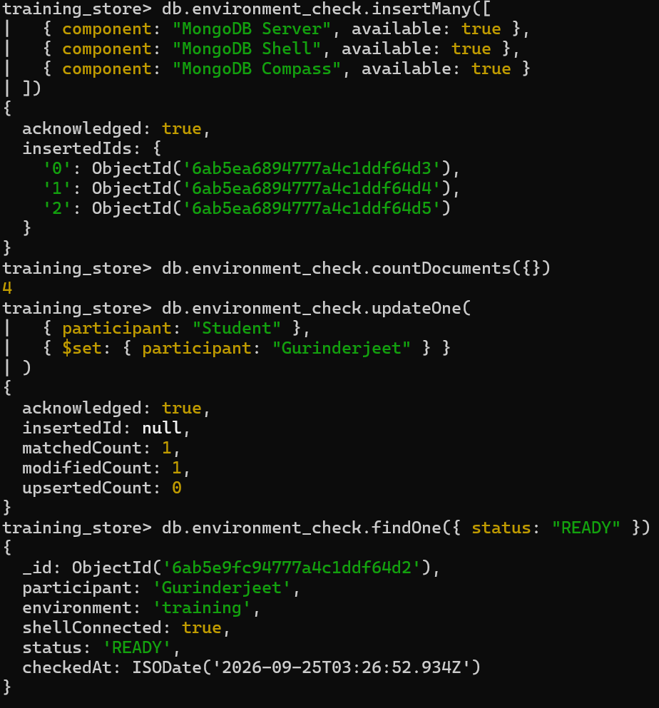

---

## Step 9 — Prove update and delete with the probe product `LAB1`

**Do this:** First check whether `products` already exists:

```javascript
show collections
```

Only if `products` is **not** listed (an empty server), create it:

```javascript
db.createCollection("products")
```

> If `training_store` is already loaded, `products` exists and `createCollection("products")` fails with **Collection already exists** — skip it. Do not drop or change any real catalog product.

Then run the probe:

```javascript
db.products.insertOne({
  sku: "LAB1",
  name: "Connectivity Probe",
  category: "ACCESSORY",
  active: true
})

db.products.find({ sku: "LAB1" })

db.products.updateOne(
  { sku: "LAB1" },
  { $set: { verified: true } }
)

db.products.deleteOne({ sku: "LAB1" })

db.products.find({ sku: "LAB1" })
```

**Expected result:**

- `insertOne` returns an `insertedId`.
- `find` shows the probe.
- `updateOne` returns `matchedCount: 1, modifiedCount: 1`.
- `deleteOne` returns `{ acknowledged: true, deletedCount: 1 }`.
- The final `find` returns **nothing** — that is the proof. `LAB1` is not a catalog SKU, so it must be gone before Module 3's Lab 2.

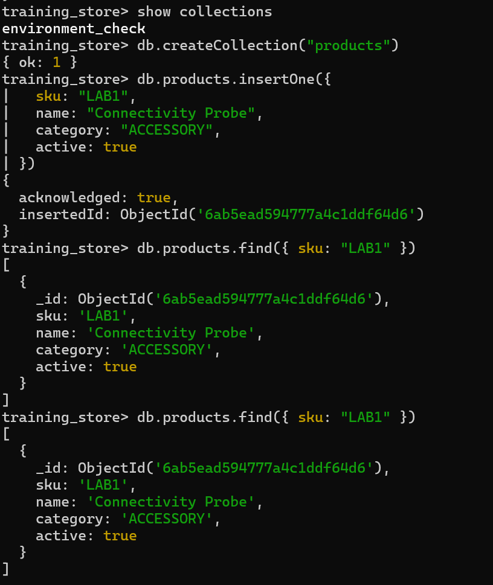

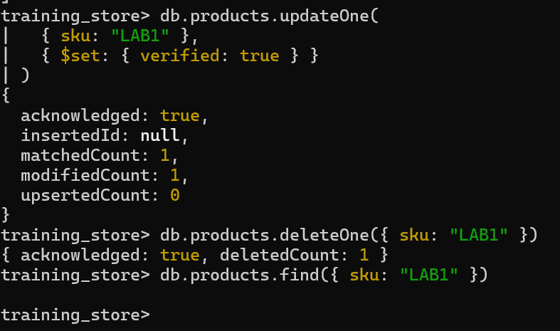

Optional, only if `training_store` is already loaded — read a real product without changing it:

```javascript
db.products.findOne({ sku: "B300" }, { name: 1, price: 1, _id: 0 })
```

Expected: `{ name: 'MongoDB Fundamentals', price: Decimal128('59.99') }`.

---

## Step 10 — Confirm the same data in Compass

The connection was saved in Step 2. You do not create it again.

**Do this:**

1. Open Compass. If the welcome dialog is still up, click **Start**, then **+ Add new connection**, leave `mongodb://localhost:27017`, and click **Save & Connect**. For Paths B and C, paste your connection string and type the password into the password field. Do not put the password in a screenshot or a shared screen.


2. Before any lab write, the sidebar lists only `admin`, `config`, and `local`. After Step 7, click the saved `localhost:27017` connection and refresh. `training_store` appears with `environment_check` and `products`.


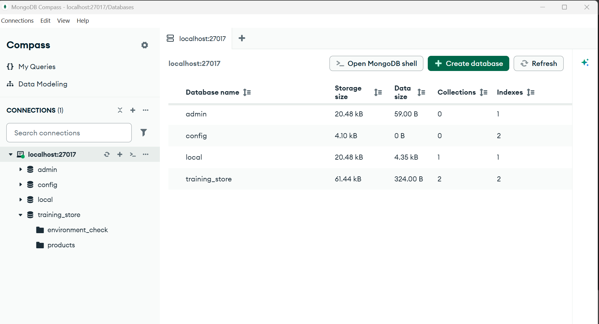

3. Open `training_store` → `environment_check`. The document count is **4**: the READY document plus the three component documents. Switch between the list, JSON, and table views if offered.

**Expected result:** Compass shows the same collection and the same READY document, with your name. The document count is **4** after Step 8 (the READY document plus the three component documents). Compass is a different window, not a different database. Tick "Compass available" on your checklist.

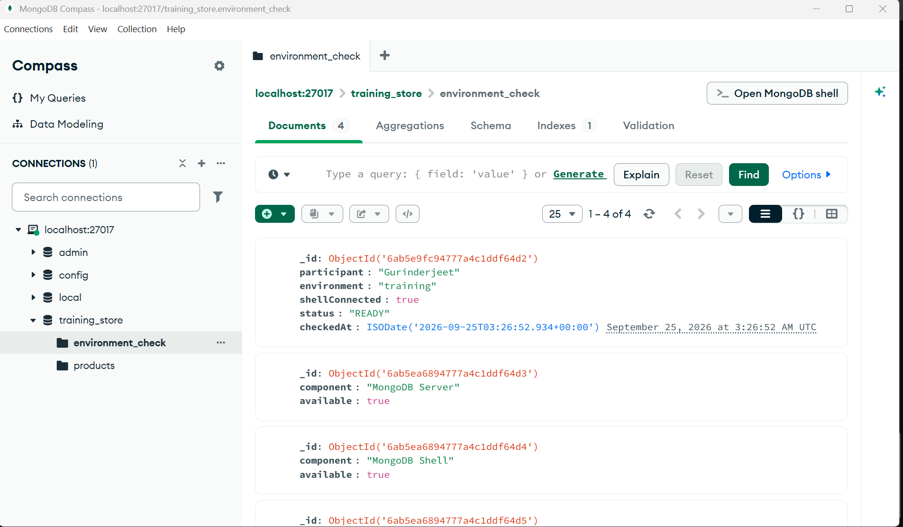

---

## Step 11 — Record the validation and finish the checklist

**Do this:** Back in `mongosh`:

```javascript
db.environment_check.insertOne({
  module: 2,
  validation: "COMPLETE",
  validatedAt: new Date()
})

db.environment_check.countDocuments({})
```

Then prove you can reconnect: type `exit`, run the Step 4 command again, and:

```javascript
use training_store
db.environment_check.findOne({ validation: "COMPLETE" })
show dbs
```

Finish [Exercise 2.4](../exercises/exercise-2.4-environment-readiness-checklist.md). Leave any box you could not prove unticked, with the symptom, the layer and your next check.

**Expected result:**

- The COMPLETE document is acknowledged; `countDocuments({})` returns **5** on a first run.
- After reconnecting, `findOne` returns the COMPLETE document, and `show dbs` now lists `training_store` — it appeared with your first write.
- Your checklist matches what you actually observed.

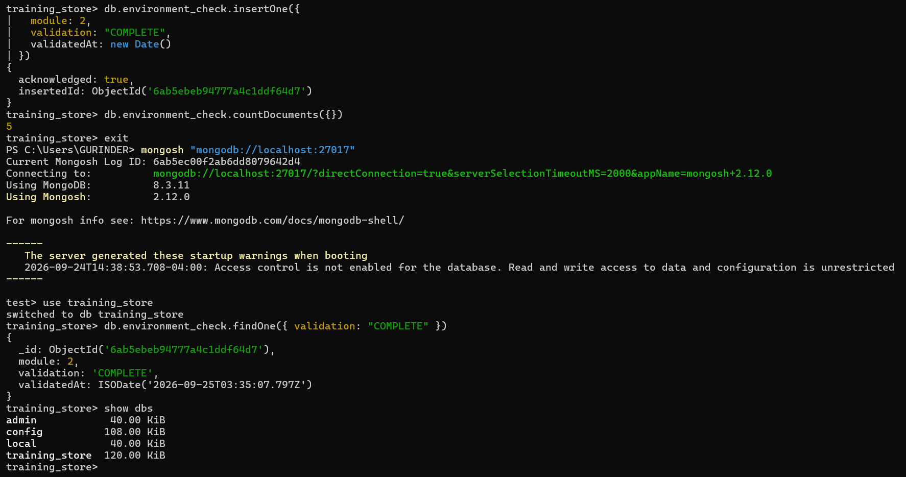

---

## Success criteria

- [ ] Server or cluster is available on the assigned path
- [ ] `mongosh` connects and `db.runCommand({ ping: 1 })` returns `ok: 1`
- [ ] `training_store.environment_check` exists
- [ ] The READY document was inserted, retrieved and updated with your name; count is 4 after Step 8
- [ ] The `LAB1` probe was inserted, found, updated and deleted — the final `find` returns nothing
- [ ] Compass shows the same document (if Compass is required)
- [ ] The COMPLETE document exists and you could reconnect
- [ ] Exercise 2.4 is complete, with only observed boxes ticked
- [ ] No real password was shared, pasted or committed anywhere

---

## Troubleshooting

Change **one** thing, then retest with `db.runCommand({ ping: 1 })`. Full table: [Exercise 2.3](../exercises/exercise-2.3-diagnose-connection-failures.md).

| Symptom | Likely layer | What to check |
| --- | --- | --- |
| `ECONNREFUSED` / connection refused on `localhost:27017` | Process or port | `Get-Service MongoDB` — if `Stopped`, `Start-Service MongoDB` as Administrator. Wrong port in the URI? |
| Service won't start | Process | Read `mongod.log` (path in `systemLog.path`): missing or unwritable `dbPath`, or port 27017 already in use. |
| `Start-Service` says access denied | Permissions | Open PowerShell **as Administrator**. |
| Server-selection timeout (Atlas) | Network | Add your **current IP** to the Atlas access list (not `0.0.0.0/0`); check the firewall or VPN. |
| `getaddrinfo ENOTFOUND` / DNS failure | Network (DNS) | Hostname typo? Copy it again from Atlas **Connect → Shell**. Check the VPN. |
| Authentication failed | Credentials | Username, password, `authSource`; retype the password at the prompt. Percent-encode special characters if they must be in a URI. |
| `not authorized on training_store` | Permission | You authenticated, but the user lacks `readWrite` on `training_store` — ask the instructor. |
| `Collection already exists` | None — expected | The collection is already there (repeat run or loaded dataset). Skip `createCollection` and continue. |
| `E11000 duplicate key … sku: "LAB1"` | Leftover probe | A previous run left `LAB1`. Run `db.products.deleteOne({ sku: "LAB1" })` and repeat Step 9. |
| `mongosh` not recognized | Client | Install `mongosh` or open a new terminal so the PATH refreshes. |
| Compass shows no new document | Client | Same URI as `mongosh`? Refresh the collection view. |
| `training_store` missing from `show dbs` after `use` | None — expected | It appears after the first write (Step 6 or 7). |

---

## Practical challenge (if time remains)

A new developer received a connection string but has not verified the environment.

1. Identify the URI components (no password on a shared screen).
2. Connect with `mongosh` and ping.
3. `use training_store` and `db.createCollection("developer_checks")`.
4. Insert:

   ```javascript
   db.developer_checks.insertOne({
     developer: "New Developer",
     shellAccess: true,
     compassAccess: true,
     readAccess: true,
     writeAccess: true,
     status: "READY",
     checkedAt: new Date()
   })
   ```

5. Retrieve it with `db.developer_checks.findOne({ status: "READY" })`, then locate the same document in Compass.

---

## Related files

- Readiness checklist: [`../exercises/exercise-2.4-environment-readiness-checklist.md`](../exercises/exercise-2.4-environment-readiness-checklist.md)
- Troubleshooting worksheet: [`../exercises/exercise-2.3-diagnose-connection-failures.md`](../exercises/exercise-2.3-diagnose-connection-failures.md)
- Sample data (loaded in Module 3's Lab 2): [`../../../datasets/training_store`](../../../datasets/training_store)
