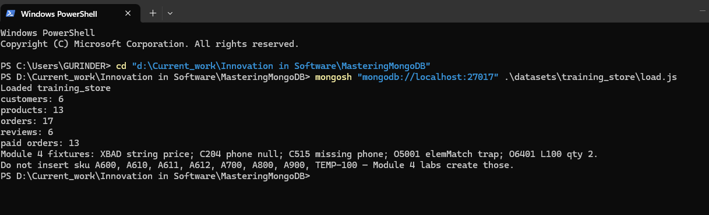
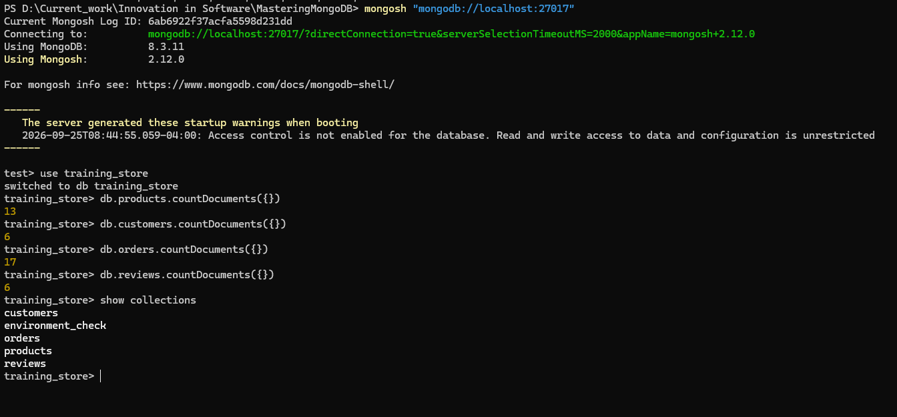
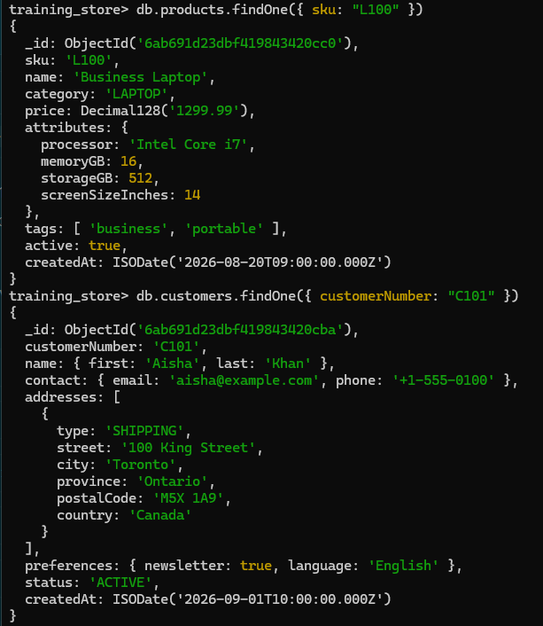
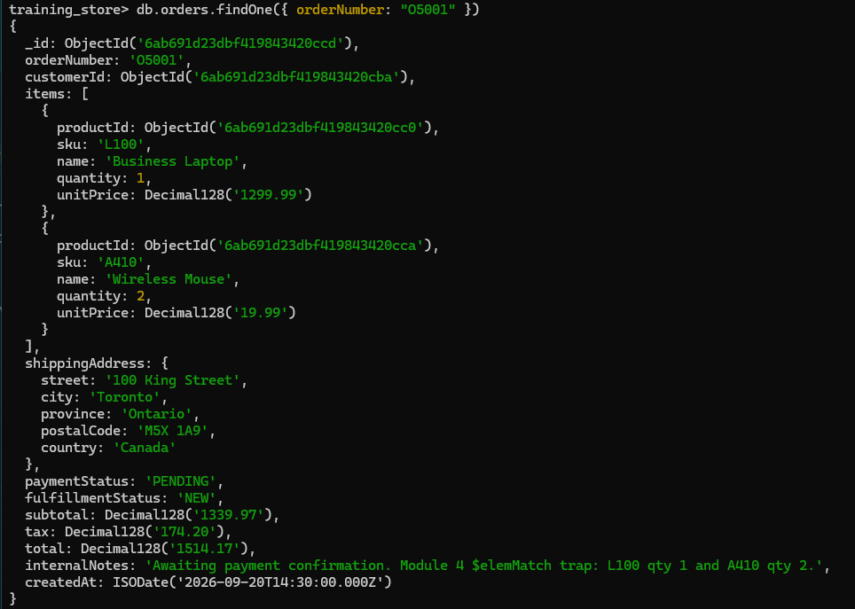
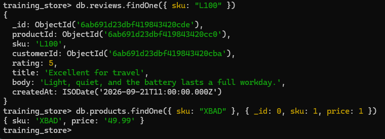
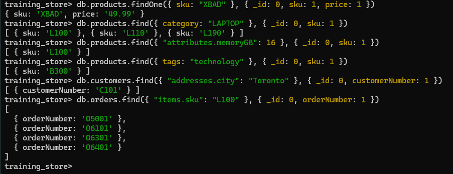
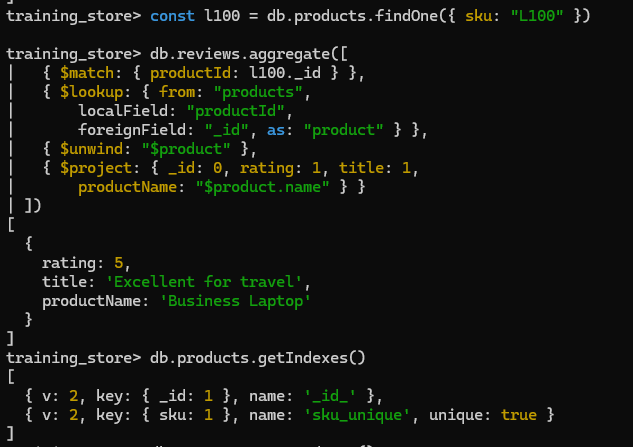
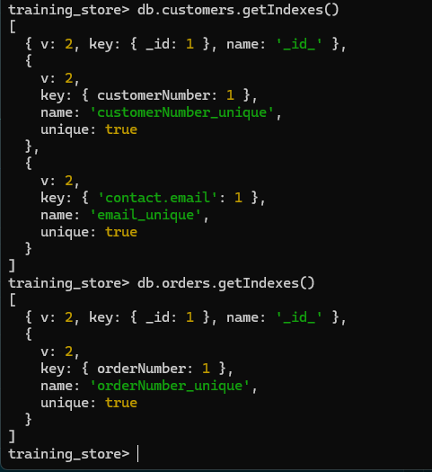
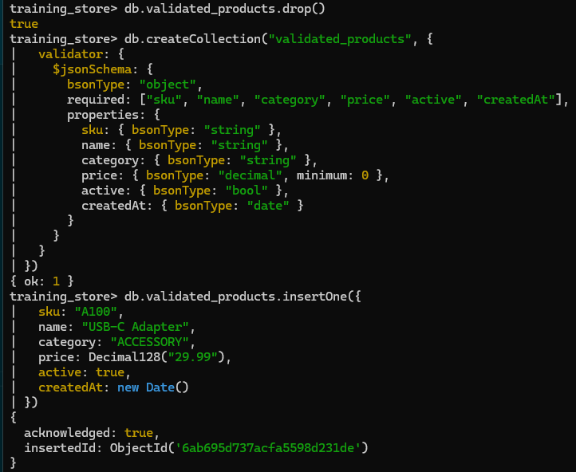
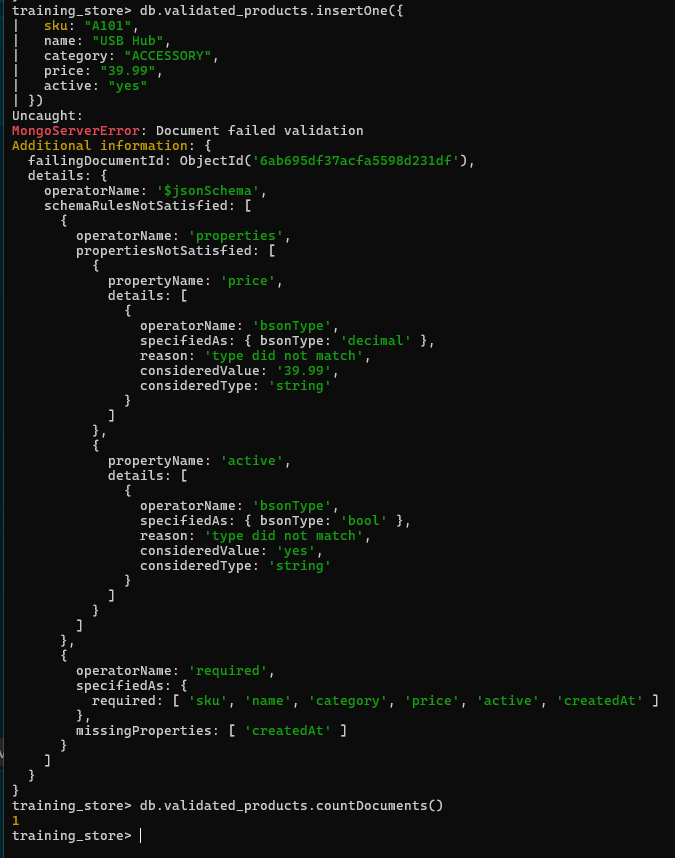

# Lab 2 — Create and Populate training_store

**Day:** 1 — Run MongoDB and Model Documents (Module 3)  
**Deck:** `decks/pptx_new/MongoDB_Module03_Data_Modeling_with_MongoDB.pptx`, slide 51  
**Time:** 50 min (Path A, load.js) · 90 min (Path B, by hand)  
**Difficulty:** Beginner

**Objective:** Put `training_store` on disk with `products`, `customers`, `orders` and `reviews`, query its nested fields, add a validator, and explain every embed and reference choice from documents you can see.

This is the outline hands-on: *creating and populating collections against a sample application dataset.*

---

## What you will finish with

- A `training_store` database with the four application collections
- Products with a shared core and category-specific `attributes`
- Customer C101 with an embedded, bounded `addresses` array
- Order O5001 that **references** the customer and **embeds** line-item snapshots
- Dot-notation queries into embedded documents and arrays
- A `validated_products` collection that rejects a badly typed document
- A completed model checklist with one planned improvement, for Day 2

---

## Knowledge you need (from Module 3)

| Module 3 idea | Where it appears in this lab |
| --- | --- |
| Shared core + flexible `attributes` | Step 2: L100, S200 and B300 |
| BSON types match meaning | `price` is `Decimal128`, `active` is Boolean, `createdAt` is a Date |
| Embed bounded data | Step 3: `addresses`; Step 4: `items`, `shippingAddress` |
| Reference shared or growing data | Step 4: `customerId`, `items[].productId`; reviews store `productId` |
| Historical snapshot | Step 4: `items[].sku`, `name`, `unitPrice` copied from the product |
| Dot notation | Step 5: `"attributes.memoryGB"`, `"addresses.city"`, `"items.sku"` |
| `$jsonSchema` validation | Step 6: `validated_products` |

The design exercises that feed this lab: [3.4 product catalog](../exercises/exercise-3.4-model-a-product-catalog.md), [3.5 order document](../exercises/exercise-3.5-model-an-order-document.md), [3.8 collection validation](../exercises/exercise-3.8-design-collection-validation.md).

---

## Before you start

**Environment:** Windows 10/11 · PowerShell · `mongosh` connected as in Day 1 Lab 1 (Module 2). Use the same connection string. Do **not** paste real passwords into chat or screenshots.

| Task | How |
| --- | --- |
| Terminal | VS Code / Cursor: ``Ctrl+` `` → PowerShell |
| Repo root | The course folder that contains `datasets\` |
| MongoDB shell | `mongosh "mongodb://localhost:27017"` (or your Atlas connection string) |
| Leave mongosh | `exit` |

Check that you are at the repo root before Path A:

```powershell
Test-Path .\datasets\training_store\load.js
```

**Expected:** `True`. If it prints `False`, `cd` to the course folder first.

If `training_store` still holds the Module 2 starter `products`, this lab **replaces** them with the modeled catalog.

---

## Choose your path

| Path | Time | What you do |
| --- | --- | --- |
| **A — load.js (time-boxed)** | 50 min | The instructor (or you) runs `load.js`, which replaces Steps 1–4 with the full dataset. Then do **Steps 5, 6 and 7**. |
| **B — by hand (full)** | 90 min | Type the core yourself: **Steps 1 to 7** in order. Reload `load.js` at the start of Day 2. |

Your instructor tells you which path the class uses.

---

## Path A — Fast path with load.js (replaces Steps 1–4)

### A1 — Load the dataset

Run this in **PowerShell** at the repo root — **not** inside `mongosh`. If a `mongosh` prompt is open, type `exit` first. Change to the course folder, then run the load as its own command:

```powershell
cd "d:\Current_work\Innovation in Software\MasteringMongoDB"
mongosh "mongodb://localhost:27017" .\datasets\training_store\load.js
```

The slide shows the same command split over two lines with a backtick (`` ` ``) at the end of the first line; the backtick is PowerShell's line continuation, so both forms run one command.

Atlas:

```powershell
mongosh "<your-atlas-connection-string>" .\datasets\training_store\load.js
```

> **macOS / Linux / Git Bash:** use forward slashes — `mongosh "mongodb://localhost:27017" ./datasets/training_store/load.js` (continue a line with `\`, not a backtick).
>
> **Already inside mongosh?** Run `load("datasets/training_store/load.js")` — the path is relative to the folder you started `mongosh` from.

**Expected:** the script prints `Loaded training_store` and the counts `customers: 6`, `products: 13`, `orders: 17`, `reviews: 6`, `paid orders: 13`. It drops and recreates the four collections and creates the unique indexes `sku_unique`, `customerNumber_unique`, `orderNumber_unique` and `email_unique` (on `contact.email`).

The last lines name documents that later modules insert or inspect (`XBAD`, `C204`, `C515`, `O5001`, `O6401`, and SKUs `A600` through `TEMP-100`). That is a reminder, not an error. Do not insert those SKUs in this lab.



### A2 — Verify the counts

Open `mongosh` and press Enter after each line. `use` and `show` fail if you paste this block together. The yellow access-control warning on connect is expected for this local server.

```javascript
use training_store
```

```javascript
db.products.countDocuments({})
```

```javascript
db.customers.countDocuments({})
```

```javascript
db.orders.countDocuments({})
```

```javascript
db.reviews.countDocuments({})
```

```javascript
show collections
```

**Expected:** products **13**, customers **6**, orders **17**, reviews **6** (slide: "Path A: 13 · 6 · 17 · 6"). `environment_check` may still be listed. Lab 1 created it, and `load.js` replaces only `products`, `customers`, `orders`, and `reviews`.



### A3 — Inspect the model

Stay at `training_store>` and press Enter after each line.

```javascript
db.products.findOne({ sku: "L100" })
```

```javascript
db.customers.findOne({ customerNumber: "C101" })
```

```javascript
db.orders.findOne({ orderNumber: "O5001" })
```

```javascript
db.reviews.findOne({ sku: "L100" })
```

```javascript
db.products.findOne({ sku: "XBAD" }, { _id: 0, sku: 1, price: 1 })
```

**Expected:** you can point to:

| Pattern | Where |
| --- | --- |
| Flexible schema | `L100.attributes` vs `S200.attributes` vs `B300.attributes` |
| Bounded embed | `C101.addresses` |
| Snapshot + reference | `O5001.items` (copied `sku`, `name`, `unitPrice`) and `O5001.customerId` |
| Unbounded data stored separately | `reviews` — not an array on the product |
| Type exception | `XBAD.price` is the **string** `'49.99'`, not Decimal128 — on purpose, for Module 4. Do not fix it. |







Now continue with **Step 5**.

---

## Path B — Steps 1 to 7

Follow the steps in order. Finish one step before starting the next.

### Step 1 — Create the sample database and collections

**Do this:** in `mongosh`:

```javascript
use training_store
db.products.drop()
db.customers.drop()
db.orders.drop()
db.reviews.drop()
db.createCollection("products")
db.createCollection("customers")
db.createCollection("orders")
db.createCollection("reviews")
show collections
```

The four `drop()` calls clear any Module 2 starter documents or an earlier `load.js` run, so the counts below are exact.

**Expected result:** the prompt shows `training_store`; each `createCollection` returns `{ ok: 1 }`; `show collections` lists `customers`, `orders`, `products` and `reviews`. MongoDB creates the database on the first write, so `show dbs` lists it only after it holds data.

---

### Step 2 — Populate products

**Do this:**

```javascript
db.products.insertMany([
  {
    sku: "L100",
    name: "Business Laptop",
    category: "LAPTOP",
    price: Decimal128("1299.99"),
    attributes: {
      processor: "Intel Core i7",
      memoryGB: 16,
      storageGB: 512,
      screenSizeInches: 14
    },
    tags: ["business", "portable"],
    active: true,
    createdAt: new Date()
  },
  {
    sku: "S200",
    name: "Running Shoe",
    category: "SHOE",
    price: Decimal128("129.99"),
    attributes: {
      sizes: [7, 8, 9, 10],
      color: "Blue",
      material: "Mesh"
    },
    tags: ["running", "sports"],
    active: true,
    createdAt: new Date()
  },
  {
    sku: "B300",
    name: "MongoDB Fundamentals",
    category: "BOOK",
    price: Decimal128("59.99"),
    attributes: {
      author: "A. Trainer",
      isbn: "978-0000000000",
      language: "English"
    },
    tags: ["database", "technology"],
    active: true,
    createdAt: new Date()
  }
])
db.products.find()
```

**Expected result:** three `insertedIds`. Each product has the same core (`sku`, `name`, `category`, `price`, `tags`, `active`, `createdAt`); category-specific fields are under `attributes`. Prices print as `Decimal128('1299.99')`.

---

### Step 3 — Populate customers

**Do this:**

```javascript
db.customers.insertOne({
  customerNumber: "C101",
  name: {
    first: "Aisha",
    last: "Khan"
  },
  contact: {
    email: "aisha@example.com",
    phone: "+1-555-0100"
  },
  addresses: [
    {
      type: "SHIPPING",
      street: "100 King Street",
      city: "Toronto",
      province: "Ontario",
      postalCode: "M5X 1A9",
      country: "Canada"
    }
  ],
  preferences: {
    newsletter: true,
    language: "English"
  },
  status: "ACTIVE",
  createdAt: new Date()
})

db.customers.findOne({ customerNumber: "C101" })
```

**Expected result:** `acknowledged: true` and an `insertedId`. `findOne` returns one document; you can point to the embedded `name`, `contact` and `addresses[0].city`. The address is a bounded array, not a separate collection.

---

### Step 4 — Populate orders

**Do this:** load the customer and the product, then insert the order using their values:

```javascript
const customer = db.customers.findOne({ customerNumber: "C101" })
const product = db.products.findOne({ sku: "L100" })
customer._id
product.price
```

Both must print a value, not `null`. Then:

```javascript
db.orders.insertOne({
  orderNumber: "O5001",
  customerId: customer._id,
  items: [
    {
      productId: product._id,
      sku: product.sku,
      name: product.name,
      quantity: 1,
      unitPrice: product.price
    }
  ],
  shippingAddress: {
    street: "100 King Street",
    city: "Toronto",
    province: "Ontario",
    postalCode: "M5X 1A9",
    country: "Canada"
  },
  paymentStatus: "PENDING",
  fulfillmentStatus: "NEW",
  subtotal: Decimal128("1299.99"),
  tax: Decimal128("169.00"),
  total: Decimal128("1468.99"),
  createdAt: new Date()
})

db.orders.findOne({ orderNumber: "O5001" })
db.orders.findOne({ orderNumber: "O5001" }).customerId.equals(customer._id)
```

> `const` names last for the whole mongosh session. If you run this block a second time, you get `SyntaxError: Identifier 'customer' has already been declared` — reuse the existing `customer` and `product`, or open a new `mongosh`.

**Expected result:** one order document; the last line prints `true`. Items and the shipping address are embedded; the customer is an id reference, not a copy of the profile. The line item keeps `sku`, `name` and `unitPrice`.

This hand-built O5001 has only the laptop, total **1468.99**. The `load.js` version also has two Wireless Mice (A410) and totals **1514.17**; reloading `load.js` on Day 2 replaces it.

---

### Step 5 — Query nested fields and arrays

*(Both paths.)*

**Do this:** Stay at `training_store>`. Press Enter after each line. The second argument keeps the output to the key field. On Path A the results are L100, L110, and L190; then L100; then B300; then C101; then O5001, O6101, O6301, and O6401.

```javascript
db.products.find({ category: "LAPTOP" }, { _id: 0, sku: 1 })
```

```javascript
db.products.find({ "attributes.memoryGB": 16 }, { _id: 0, sku: 1 })
```

```javascript
db.products.find({ tags: "technology" }, { _id: 0, sku: 1 })
```

```javascript
db.customers.find({ "addresses.city": "Toronto" }, { _id: 0, customerNumber: 1 })
```

```javascript
db.orders.find({ "items.sku": "L100" }, { _id: 0, orderNumber: 1 })
```

**Expected result:**

| Query | Path B (hand-built core) | Path A (after load.js) |
| --- | --- | --- |
| `category: "LAPTOP"` | L100 | L100, L110, L190 |
| `"attributes.memoryGB": 16` | L100 | L100 |
| `tags: "technology"` | B300 | B300 |
| `"addresses.city": "Toronto"` | C101 | C101 |
| `"items.sku": "L100"` | O5001 | O5001, O6101, O6301, O6401 |



Dotted paths must be in quotes: a dotted path is not a valid JavaScript identifier. When the path crosses an array (`tags`, `addresses`, `items`), MongoDB checks every element. Module 4 goes further with `$elemMatch`.

**Optional (Path A only) — join and indexes.** The hand-built core has no reviews and no extra indexes, so run these only after `load.js`. Press Enter after each statement. Paste the aggregate as one statement.

```javascript
const l100 = db.products.findOne({ sku: "L100" })
```

```javascript
db.reviews.aggregate([
  { $match: { productId: l100._id } },
  { $lookup: { from: "products",
      localField: "productId",
      foreignField: "_id", as: "product" } },
  { $unwind: "$product" },
  { $project: { _id: 0, rating: 1, title: 1,
      productName: "$product.name" } }
])
```

```javascript
db.products.getIndexes()
```

```javascript
db.customers.getIndexes()
```

```javascript
db.orders.getIndexes()
```

**Expected:** one result `{ rating: 5, title: 'Excellent for travel', productName: 'Business Laptop' }`. Indexes: products `_id_`, `sku_unique`; customers `_id_`, `customerNumber_unique`, `email_unique` (key `contact.email`); orders `_id_`, `orderNumber_unique`. Do not re-create these — Module 6 adds the planned `{ category: 1, price: 1 }`, `{ customerId: 1, createdAt: -1 }` and `{ productId: 1, createdAt: -1 }` indexes.





---

### Step 6 — Add collection validation

*(Both paths.)* The main `products` collection keeps XBAD's string price for Module 4, so you try validation on a **separate** collection.

**Do this:**

```javascript
db.validated_products.drop()
db.createCollection("validated_products", {
  validator: {
    $jsonSchema: {
      bsonType: "object",
      required: ["sku", "name", "category", "price", "active", "createdAt"],
      properties: {
        sku: { bsonType: "string" },
        name: { bsonType: "string" },
        category: { bsonType: "string" },
        price: { bsonType: "decimal", minimum: 0 },
        active: { bsonType: "bool" },
        createdAt: { bsonType: "date" }
      }
    }
  }
})

db.validated_products.insertOne({
  sku: "A100",
  name: "USB-C Adapter",
  category: "ACCESSORY",
  price: Decimal128("29.99"),
  active: true,
  createdAt: new Date()
})
```

Then try an invalid insert and read the error:

```javascript
db.validated_products.insertOne({
  sku: "A101",
  name: "USB Hub",
  category: "ACCESSORY",
  price: "39.99",
  active: "yes"
})
```

**Expected result:** `createCollection` returns `{ ok: 1 }`; the valid insert returns `acknowledged: true`. The invalid insert is **rejected** with `MongoServerError: Document failed validation`. In the `details`, find the three failed rules: `price` is a string (not `decimal`), `active` is a string (not `bool`), and `createdAt` is missing. `db.validated_products.countDocuments()` is **1**. `drop()` prints `true` when that collection already existed and was removed, and `false` when it did not.





---

### Step 7 — Validate the data model

*(Both paths. Discussion in pairs; use `mongosh` only to re-open a document.)*

**Do this:** tick each item for `products`, `customers` and `orders`, then write one improvement you would make later (an index, an extra field, or validation on `orders`).

- [ ] Frequently accessed values are stored together (order items and shipping address on the order)
- [ ] Arrays are bounded (`addresses`, `items`, `tags`); reviews are a separate collection
- [ ] Financial values are Decimal128 (and you noted XBAD's string price)
- [ ] Timestamps are Dates (`createdAt`)
- [ ] Required fields are identified
- [ ] Relationships are deliberately embedded or referenced
- [ ] Historical snapshots are preserved on the order
- [ ] Collection names are plural and consistent
- [ ] Field names are consistent (camelCase: `customerId`, `createdAt`)
- [ ] The main queries from Exercise 3.2 can run

**Review questions — one sentence each:**

1. Why are customer addresses embedded?
2. Why are product reviews stored separately?
3. Why does an order item contain both `productId` and a copied `name`?
4. What happens to old orders if the product price changes?
5. Should order items live in a separate collection?
6. Which BSON types should money and timestamps use?
7. Which relationships still need a second query or `$lookup`?
8. Which arrays are bounded, and which could grow without limit?

**Expected result:** a completed checklist with at least one future improvement. Bring it to Day 2.

---

## Success criteria

- [ ] Four collections exist in `training_store`
- [ ] Counts match — Path A: 13 · 6 · 17 · 6; Path B: 3 · 1 · 1 · 0 (products · customers · orders · reviews)
- [ ] O5001's `customerId` equals C101's `_id`
- [ ] The nested queries in Step 5 returned the expected documents
- [ ] The invalid insert in Step 6 was rejected
- [ ] You noted that XBAD's `price` is a string on purpose
- [ ] You can explain one embed choice and one reference choice from a real document

---

## Troubleshooting

| Symptom | Cause | Fix |
| --- | --- | --- |
| `SyntaxError: Missing semicolon` or `Unexpected token` when running the `mongosh … load.js` line | You pasted the PowerShell command **inside** mongosh | `exit`, then run it at the PowerShell prompt — or use `load("datasets/training_store/load.js")` inside mongosh |
| `ENOENT: no such file or directory … load.js` | Not at the repo root, or wrong slashes | `Test-Path .\datasets\training_store\load.js` must print `True`; on macOS/Linux use `./datasets/...` |
| `MongoNetworkError: connect ECONNREFUSED 127.0.0.1:27017` | MongoDB is not running | Start the service or container from Lab 1, then retry |
| Two-line command runs only the first line | Missing backtick or a space after it | Use the single-line command |
| `E11000 duplicate key error … customerNumber_unique` (or `orderNumber_unique`) in Path B | `load.js` data is still there | Run the `drop()` lines in Step 1 again, then Steps 2–4 |
| `SyntaxError: Identifier 'customer' has already been declared` | Step 4's `const` block ran twice | Reuse the variables, or open a new `mongosh` |
| `customer` or `product` is `null` in Step 4 | Step 2 or 3 was skipped, or you are in the wrong database | `use training_store`; re-run Steps 2 and 3 |
| `Collection already exists` in Step 6 | An earlier attempt | Run `db.validated_products.drop()` first (it is in the step) |
| The valid insert in Step 6 fails | `price: 29.99` typed without `Decimal128(...)` — a Double is not `decimal` | Use `Decimal128("29.99")` |
| Step 5 LAPTOP returns one document on Path A | `load.js` did not run, or ran against another server | Re-run A1 with the same connection string you use for mongosh |

---

## Before Day 2

Whichever path you used, reload `load.js` at the start of Day 2 (Step A1) so Modules 4 and 5 have the full analytical data. Keep the same connection string. `load.js` does not touch `validated_products`.

Instructor answer key: [solution/LAB-2-SOLUTION.md](solution/LAB-2-SOLUTION.md).
