# Lab 4 — Aggregation Pipeline

**Day:** 2 — Query and Transform Data · **Module 5** (The Aggregation Framework)  
**Deck:** `decks/pptx_new/MongoDB_Module05_The_Aggregation_Framework.pptx`, slide 51 (Lab 4)  
**Time:** 45–60 minutes  
**Difficulty:** Intermediate

**Objective:** Build one multi-stage pipeline that filters completed paid sales, unwinds the line items, joins each line to its product, groups by category and returns a ranked report, then prove one of its numbers with a second pipeline.

This is the course outline hands-on *Building an aggregation pipeline*.

---

## What you will finish with

- A verified, freshly loaded `training_store`
- A count of the orders the report is built on
- One pipeline of about ten stages that returns the top product categories for completed paid sales, with units, sales, distinct customers and sales per customer
- One number from that report checked by a second, independent pipeline
- (Optional) an explain plan showing that `$match` runs first

---

## Knowledge you need (from Module 5)

| Module 5 idea | How it appears in this lab |
| --- | --- |
| **Real field paths** | `paymentStatus` and `fulfillmentStatus`, not a single `status`; `items.quantity` and `items.unitPrice`, not `lineTotal` |
| **Filter first** | `$match` is stage 1, before `$unwind` multiplies the documents |
| **`$unwind`** | One document per order line |
| **Calculated fields** | `lineSales = quantity × unitPrice`, computed with `$set` |
| **`$lookup`** | Each line is joined to `products` for its `category`; the result is an array |
| **`$group` + accumulators** | `$sum` for units and sales, `$addToSet` for distinct customers |
| **Filter groups** | A `$match` **after** `$group` keeps categories with sales of at least 50 |
| **Top-N** | `$sort` before `$limit` |
| **Build one stage at a time** | Each step adds stages and checks the count before going on |
| **Double-counting** | Sum line values after `$unwind`, never the order `total` |

---

## Business requirement

Report the top-selling **product categories** for completed sales:

- Include only **PAID** orders that are **SHIPPED** or **DELIVERED**
- Expand line items
- Join each item to the current product (for its category)
- Group by `product.category`
- Total units, total sales, distinct customers, sales per customer
- Keep categories with sales of at least 50
- Sort highest sales first; return the top five

---

## Environment basics (read this first)

| Task | How |
| --- | --- |
| Environment | Windows 10/11 · PowerShell · `mongosh` |
| Repository root | The folder that contains `datasets\training_store\load.js` |
| Terminal | PowerShell for the reload; `mongosh` for every pipeline |
| Connection | The Module 2 connection string, for example `mongodb://localhost:27017` |
| Paste | Paste one code block at a time. Multi-line pipelines are fine in `mongosh`. |

---

## Before you start

### Reload `load.js`

Lab 3 changed `O6202` (marked SHIPPED) and `A410`, and the Module 4 labs inserted extra products. For the expected numbers, reload the dataset. In **PowerShell**, from the repository root (not inside `mongosh`):

```powershell
mongosh "mongodb://localhost:27017" .\datasets\training_store\load.js
```

The script drops and re-creates the four collections and prints the counts. The lines after that about `XBAD`, `C204`, and SKUs such as `A600` are a Module 4 reminder. They are not errors. Do not insert those SKUs.

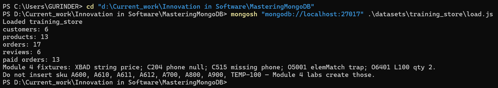

Then open the shell:

```powershell
mongosh "mongodb://localhost:27017"
```

```javascript
use training_store
```

### Step 0 — Verify the dataset

**Do this:**

```javascript
db.products.countDocuments()
db.customers.countDocuments()
db.orders.countDocuments()
db.reviews.countDocuments()
db.orders.countDocuments({ paymentStatus: "PAID" })
db.orders.findOne({ orderNumber: "O6301" })
```

**Expected result:** products **13**, customers **6**, orders **17**, reviews **6**, paid orders **13**. The access-control startup warning is expected on this local server. In O6301, note the paths this lab uses: `paymentStatus`, `fulfillmentStatus`, `customerId`, `items` (an array), `items.productId`, `items.quantity`, `items.unitPrice` (Decimal128) and `total`.

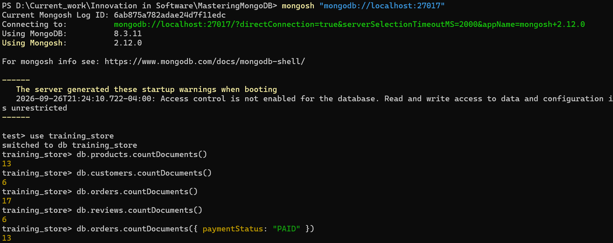

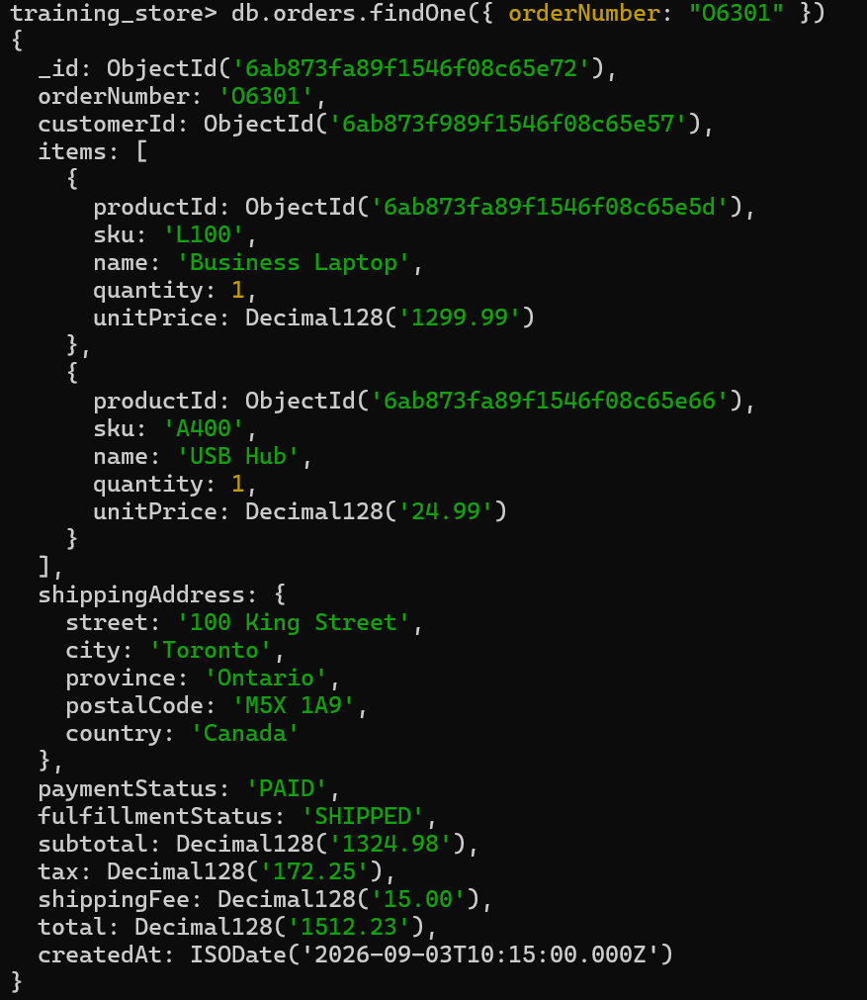

If a count is different, rerun the reload.

---

## Steps

### Step 1 — Confirm the input set

**Do this:**

```javascript
db.orders.countDocuments({
  paymentStatus: "PAID",
  fulfillmentStatus: { $in: ["SHIPPED", "DELIVERED"] }
})
```

**Expected result:** **10** orders: the 13 paid orders minus the two PROCESSING ones (`O6202`, `O6302`) and the NEW one (`O6305`). This is the input the report must be built on.

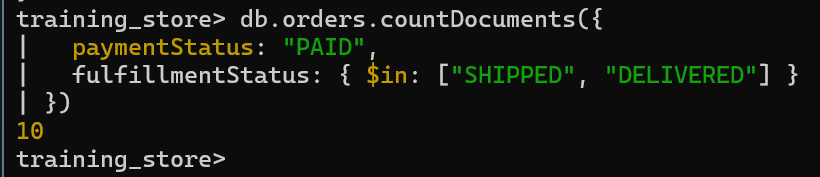

---

### Step 2 — Filter, unwind and compute line sales

**Do this:** Run only the first three stages and inspect two documents:

```javascript
db.orders.aggregate([
  {
    $match: {
      paymentStatus: "PAID",
      fulfillmentStatus: { $in: ["SHIPPED", "DELIVERED"] }
    }
  },
  { $unwind: "$items" },
  {
    $set: {
      lineSales: { $multiply: ["$items.quantity", "$items.unitPrice"] }
    }
  },
  { $limit: 2 }
])
```

Then replace `{ $limit: 2 }` with `{ $count: "lines" }` and run it again.

**Expected result:** Each output document is one order line: `items` is a single object, not an array. `lineSales` is a Decimal128 (quantity × the `unitPrice` stored on the order). The first two lines are **O6101** / **L100** at 1299.99 and **O6102** / **S200** at 129.99. The count is **{ lines: 18 }**.

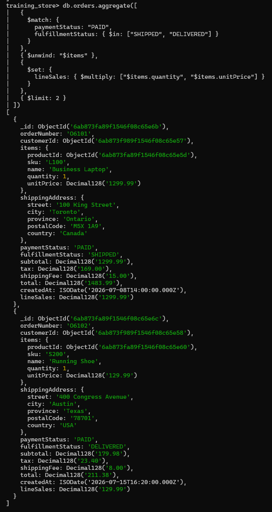

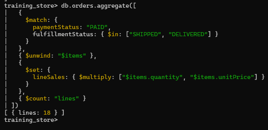

---

### Step 3 — Join the product and group by category

**Do this:** Build the full report. If you want, add the stages two at a time and rerun, as in Module 5.

```javascript
db.orders.aggregate([
  {
    $match: {
      paymentStatus: "PAID",
      fulfillmentStatus: { $in: ["SHIPPED", "DELIVERED"] }
    }
  },
  { $unwind: "$items" },
  {
    $set: {
      lineSales: { $multiply: ["$items.quantity", "$items.unitPrice"] }
    }
  },
  {
    $lookup: {
      from: "products",
      localField: "items.productId",
      foreignField: "_id",
      as: "product"
    }
  },
  { $unwind: "$product" },
  {
    $group: {
      _id: "$product.category",
      totalUnitsSold: { $sum: "$items.quantity" },
      totalSales: { $sum: "$lineSales" },
      customers: { $addToSet: "$customerId" }
    }
  },
  {
    $set: {
      distinctCustomers: { $size: "$customers" },
      salesPerCustomer: { $divide: ["$totalSales", { $size: "$customers" }] }
    }
  },
  { $match: { totalSales: { $gte: Decimal128("50.00") } } },
  { $sort: { totalSales: -1 } },
  { $limit: 5 },
  {
    $project: {
      _id: 0,
      category: "$_id",
      totalUnitsSold: 1,
      totalSales: 1,
      distinctCustomers: 1,
      salesPerCustomer: 1
    }
  }
])
```

**Expected result:** **LAPTOP** is first, from the high unit prices of `L100` and `L110`. On a fresh load the four rows, highest sales first, are LAPTOP (3 units, 4499.97, 2 customers), ACCESSORY (9, 744.91, 4), SHOE (3, 264.97, 2) and BOOK (5, 259.95, 3). Every line finds its product; an empty `$lookup` array would mean a broken `productId`, and a plain `$unwind` would then drop that line.

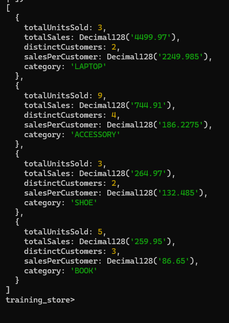

Write down LAPTOP's `totalUnitsSold`: Step 4 checks it.

---

### Step 4 — Prove one number

**Do this:** Count laptop units from completed paid orders with a second, independent pipeline:

```javascript
db.orders.aggregate([
  {
    $match: {
      paymentStatus: "PAID",
      fulfillmentStatus: { $in: ["SHIPPED", "DELIVERED"] }
    }
  },
  { $unwind: "$items" },
  { $match: { "items.sku": { $in: ["L100", "L110", "L190"] } } },
  { $group: { _id: null, units: { $sum: "$items.quantity" } } }
])
```

**Expected result:** The unit count equals `totalUnitsSold` for LAPTOP in Step 3, which is **3**. `L190` is in the SKU list but is not on a paid shipped or delivered order, so it adds no units.

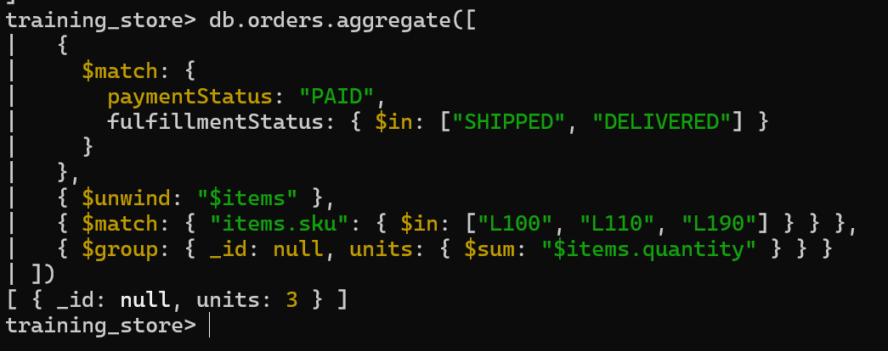

---

### Step 5 — Optional: check the plan

**Do this:** If time remains, explain the Step 3 pipeline:

```javascript
db.orders.explain("executionStats").aggregate([ /* the Step 3 stages */ ])
```

Find the first stage, and the number of documents examined.

**Expected result:** The first stage is the `$match`, shown inside `$cursor`. With no index on `paymentStatus` yet, the plan is a `COLLSCAN`: `totalDocsExamined` is **17** and `nReturned` is **10**. `$unwind` then returns **18** lines. `$lookup` uses the products `_id_` index. `$group` and every later stage return **4**. The command ends with `ok: 1`. On 17 orders the timings mean nothing: read the plan shape. Module 6 adds the index.

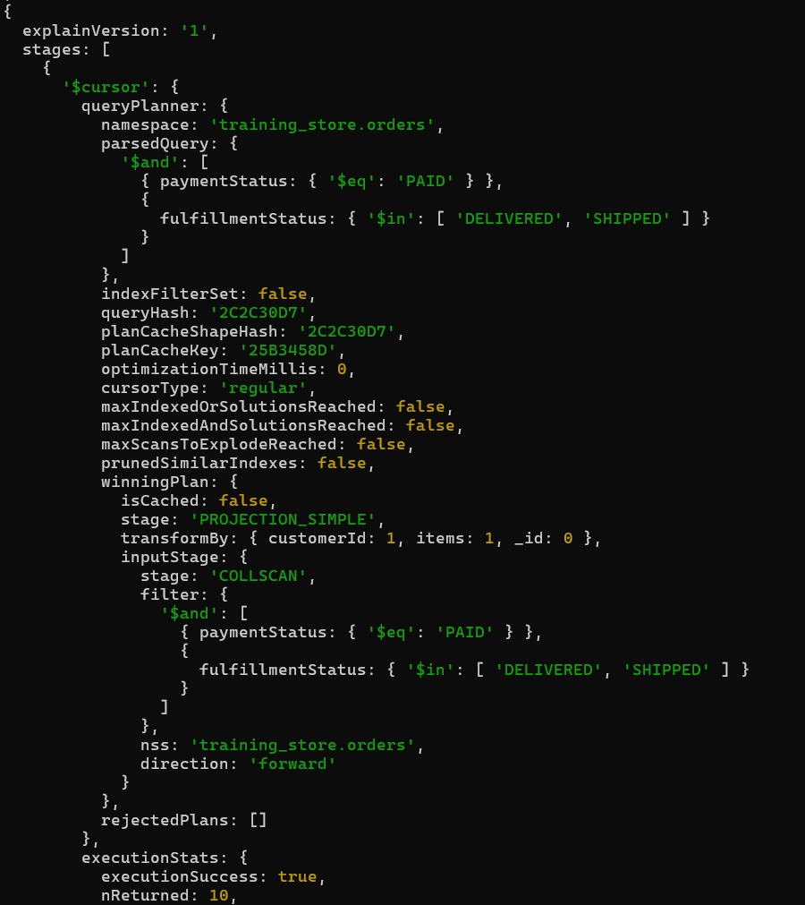

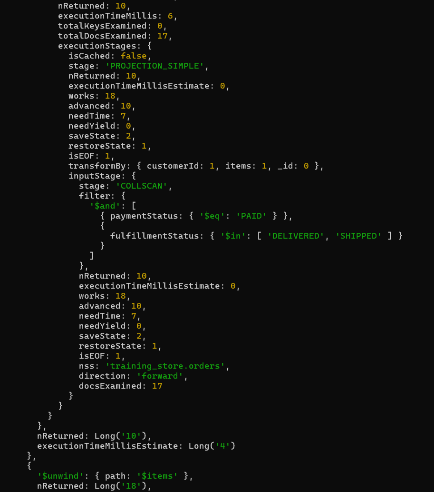

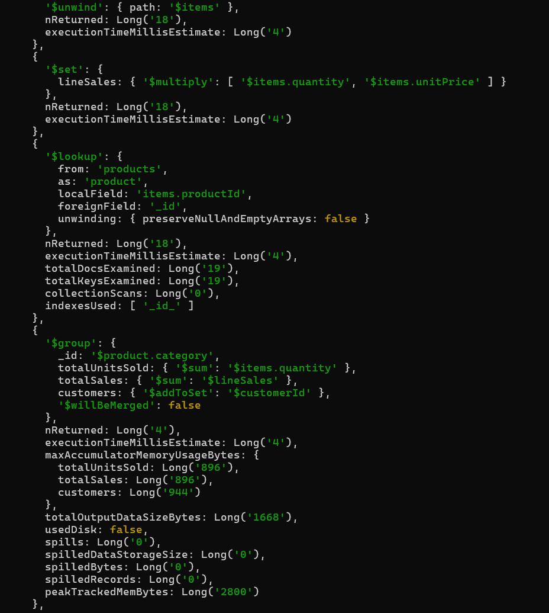

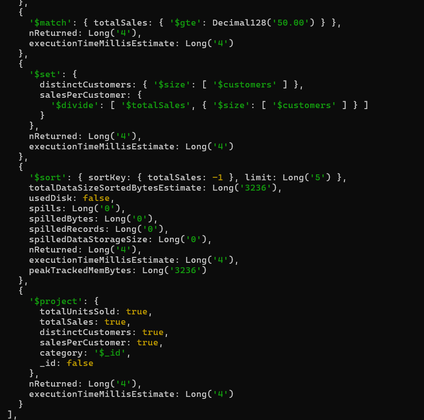

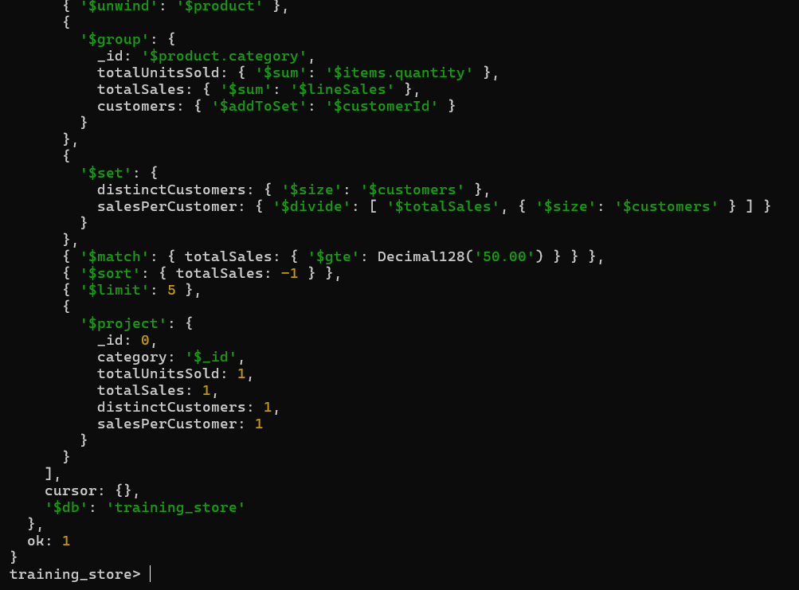

---

## Success criteria

- [ ] Step 0 counts match: 13 · 6 · 17 · 6, 13 paid
- [ ] The pipeline uses `paymentStatus` and `fulfillmentStatus`, not a single `status` field
- [ ] Line sales are computed as `quantity × unitPrice`, not read from a missing `lineTotal`
- [ ] `$unwind` comes after the order-level `$match`
- [ ] `$lookup` comes after `$unwind` (item → product)
- [ ] The top category is LAPTOP on a fresh load
- [ ] One grouped metric was checked with a second pipeline

---

## Troubleshooting

| Symptom | Likely cause | Fix |
| --- | --- | --- |
| Step 0 shows 7 reviews or more than 13 products | Lab 3 or Module 4 changes are still there | Rerun `load.js` from PowerShell |
| Step 1 returns **11**, and LAPTOP differs from the instructor's numbers | Lab 3 marked `O6202` SHIPPED, adding one Ultrabook to the input | Reload, or accept the changed numbers and say so |
| Step 1 or 3 returns **0** documents | `status: "Shipped"`, or lower-case values such as `"Paid"` | Use `paymentStatus: "PAID"` and `fulfillmentStatus` in upper case |
| `totalSales` is **0** for every category | Summing `$items.lineTotal`, which does not exist | Compute `lineSales` with `$multiply` |
| Sales are far too high | Summing `$total` after `$unwind` | Sum `$lineSales`; `total` repeats on every line |
| Only one row, with `category` null or `"product.category"` | `$group` on `"$category"` (orders have no category) or on `"product.category"` without `$` | Group on `"$product.category"` |
| Categories disappear after `$lookup` | `localField: "productId"` instead of `"items.productId"` | After `$unwind` the id is under `items` |
| `$match` on 50 removes everything | Comparing with a plain string `"50.00"` | Use `Decimal128("50.00")` (or the number 50) |
| `ReferenceError: NumberDecimal is not defined` | Very old syntax | In `mongosh`, use `Decimal128("50.00")` |
| `use training_store` fails inside a script | `use` is a shell helper | Run it interactively, or `db = db.getSiblingDB("training_store")` |

---

## What's next

Keep your Step 3 pipeline. Module 6 (Day 3) asks which index supports its first `$match`, for example `{ paymentStatus: 1, fulfillmentStatus: 1 }`, and checks it with `explain`.
