# Lab 5 — Index and Explain

**Day:** 3 — Tune, Scale and Ship · **Module 6** (Indexing and Query Performance)  
**Deck:** `decks/pptx_new/MongoDB_Module06_Indexing_and_Query_Performance.pptx` — slide 49, "Lab 5 — Index and Explain"  
**Time:** 40–50 minutes for the six core steps · about 45 minutes more for the Go-further steps 7–13  
**Difficulty:** Intermediate

**Objective:** Measure a query with `explain("executionStats")`, create an index for its shape, and measure again. Do it for customer order history, a fulfillment queue and a tag search, then inventory every index and say what each one is for.

---

## What you will finish with

- A **before and after** record for C101's order history: `SORT` + `COLLSCAN` before, `IXSCAN` with 5 keys and 5 documents after
- Three named indexes: `idx_orders_customer_date`, `idx_orders_fulfillment_date` and `idx_products_tags`
- Proof that a different query shape needs a different leading field
- A multikey index on the `tags` array
- An index inventory for all four collections, with a purpose for every index
- *(Go further)* catalog, unique, partial, TTL, covered, aggregation and hide-and-test practice on the same data

**Small data, real signals.** 13 products and 17 orders scan in a millisecond either way. Record the **plan shape** (`COLLSCAN`, `IXSCAN`, `FETCH`, `SORT`), the **index name**, and the three numbers **nReturned**, **totalKeysExamined** and **totalDocsExamined**. That evidence is the lab — not the timings.

---

## Knowledge you need (from Module 6)

| Module 6 idea | How it appears in this lab |
| --- | --- |
| COLLSCAN versus IXSCAN | Step 1's baseline reads every order; Step 3 reads only C101's keys. |
| Named indexes | Every index you create gets an `idx_…`, `uq_…` or `ttl_…` name, so plans are easy to read. |
| Compound indexes and ESR | `{ customerId: 1, createdAt: -1 }`: equality, then the sort. |
| The prefix rule | Step 4: the history index can't serve a query that doesn't filter on `customerId`. |
| Multikey indexes | Step 5: `tags` is an array, so the index stores one key per value. |
| Blocking sort | A `SORT` stage in the plan means an in-memory sort; the right index removes it. |
| Unique, partial, TTL, covered | Go-further Steps 9–11. |
| `$indexStats` and `hideIndex()` | Go-further Step 13. |

---

## Before you start

Do everything in **PowerShell** on the classroom machine, from the **repository root** (the folder that contains `datasets`).

### Reload training_store

Reload so Lab 3's writes (and any indexes from demos) are gone. This is a PowerShell command, not a `mongosh` command. The backtick at the end of the first line is PowerShell's line continuation:

```powershell
mongosh "mongodb://localhost:27017" `
  .\datasets\training_store\load.js
```

**Expected:**

```text
Loaded training_store
customers: 6
products: 13
orders: 17
reviews: 6
paid orders: 13
Module 4 fixtures: XBAD string price; C204 phone null; C515 missing phone; O5001 elemMatch trap; O6401 L100 qty 2.
```

`load.js` drops and recreates `customers`, `products`, `orders` and `reviews`, which also removes any index you created on them earlier. It does **not** touch a `sessions` collection; Step 10 recreates that one. The lines after the counts, about `XBAD` and SKUs such as `A600`, are a Module 4 reminder. They are not errors. Do not insert those SKUs.

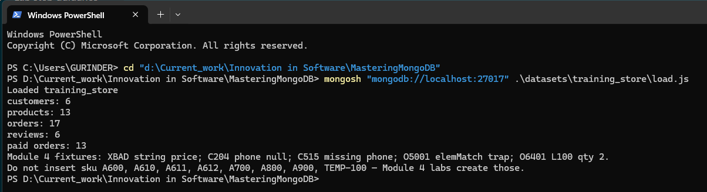

Then open the shell:

```powershell
mongosh "mongodb://localhost:27017"
```

```javascript
use training_store
```

The access-control startup warning is expected on this local server. Leave authentication off.

### C101 — look it up, never copy an ObjectId

Older slides show `ObjectId("66a100000000000000000001")`. That id is **not** in this dataset. Look C101 up by `customerNumber`:

```javascript
var cid = db.customers.findOne({ customerNumber: "C101" })._id
```

(`var` lets you re-run the line safely.) Orders sort on **`createdAt`**, not `orderedAt`.

### Optional helper — one-line explain summaries

`explain()` output is long. Paste this once per `mongosh` session to print just the plan path and the three numbers:

```javascript
function summary(e) {
  const stages = [];
  let p = e.queryPlanner.winningPlan.queryPlan || e.queryPlanner.winningPlan;
  while (p) { stages.push(p.stage + (p.indexName ? " " + p.indexName : "")); p = p.inputStage; }
  const s = e.executionStats;
  return { plan: stages.join(" <- "), nReturned: s.nReturned,
           keys: s.totalKeysExamined, docs: s.totalDocsExamined };
}
```

Use it as `summary(db.orders.find(…).explain("executionStats"))`. It is for `find()` only; read aggregation plans (Step 12) directly.

---

## Core steps (slide 49)

Follow these steps in order. Finish one step before starting the next.

### Step 1 — Baseline: C101's orders, newest first

**Do this:**

```javascript
db.orders.getIndexes().map(i => i.name)

db.orders.find({ customerId: cid })
  .sort({ createdAt: -1 })
  .explain("executionStats")
```

Record:

```text
winningPlan stages:
nReturned:
totalKeysExamined:
totalDocsExamined:
SORT stage? (yes/no):
```

Then look at the result itself:

```javascript
db.orders.find({ customerId: cid }, { _id: 0, orderNumber: 1, createdAt: 1 })
  .sort({ createdAt: -1 })
```

**Expected result:**

- Indexes on orders: `[ '_id_', 'orderNumber_unique' ]` — neither helps this query.
- Plan: `SORT` over `COLLSCAN`. **nReturned 5 · totalKeysExamined 0 · totalDocsExamined 17** — all 17 orders read, then sorted in memory.
- C101 (Aisha Khan) has five orders, newest first: **O5001, O6306, O6301, O6201, O6101**.

The shell below is MongoDB **8.3.11** and mongosh **2.12.0**. `summary()` prints the plan as `SORT <- COLLSCAN` with **nReturned 5**, **keys 0**, and **docs 17**. The ObjectId on screen is this load only; look C101 up again after every reload.

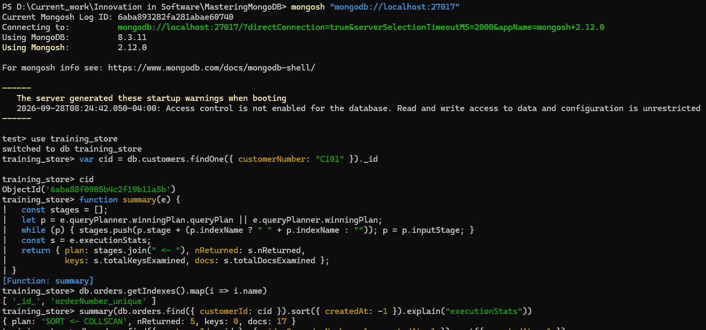

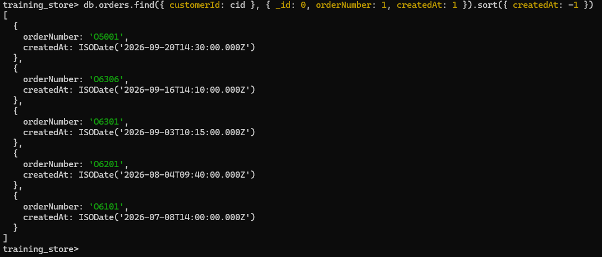

---

### Step 2 — Create the history index

**Do this:** equality on `customerId`, then the sort on `createdAt` descending.

```javascript
db.orders.createIndex(
  { customerId: 1, createdAt: -1 },
  { name: "idx_orders_customer_date" }
)
```

**Expected result:** `mongosh` prints the index name, `idx_orders_customer_date`.

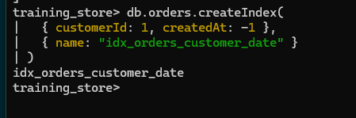

Use this one name for the history index in every step. If you already created the same key under another name (for example `idx_orders_customer_created` from an older guide), this command fails with an index-options conflict — drop the old one by name first.

---

### Step 3 — Measure again

**Do this:** re-run the explain from Step 1.

```javascript
db.orders.find({ customerId: cid })
  .sort({ createdAt: -1 })
  .explain("executionStats")
```

**Expected result:**

- Plan: `FETCH` over `IXSCAN` on `idx_orders_customer_date`. **No `SORT` stage.**
- **nReturned 5 · totalKeysExamined 5 · totalDocsExamined 5.**

17 reads plus a sort became 5 reads in order: the index groups the keys by customer and keeps each customer's keys newest first.

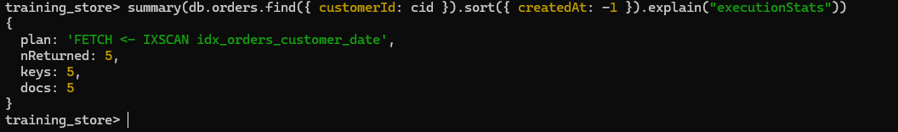

---

### Step 4 — A new shape: PROCESSING orders

Warehouse staff list PROCESSING orders, oldest first. This query does **not** filter on `customerId`.

**Do this:** explain it, create a workload-specific index, and explain again.

```javascript
db.orders.find({ fulfillmentStatus: "PROCESSING" })
  .sort({ createdAt: 1 })
  .explain("executionStats")

db.orders.createIndex(
  { fulfillmentStatus: 1, createdAt: 1 },
  { name: "idx_orders_fulfillment_date" }
)

db.orders.find({ fulfillmentStatus: "PROCESSING" })
  .sort({ createdAt: 1 })
  .explain("executionStats")

db.orders.find({ fulfillmentStatus: "PROCESSING" },
               { _id: 0, orderNumber: 1, createdAt: 1 })
  .sort({ createdAt: 1 })
```

**Expected result:**

- Before: `SORT` over `COLLSCAN`, **0 keys · 17 docs · 3 returned**. The history index can't help: its leading field is `customerId`, so `fulfillmentStatus` is not a prefix.
- After: `FETCH` over `IXSCAN` on `idx_orders_fulfillment_date`, **3 keys · 3 docs · 3 returned**, no `SORT`.
- The queue, oldest first: **O6202** (11 Aug), **O6302** (7 Sep), **O6401** (18 Sep).

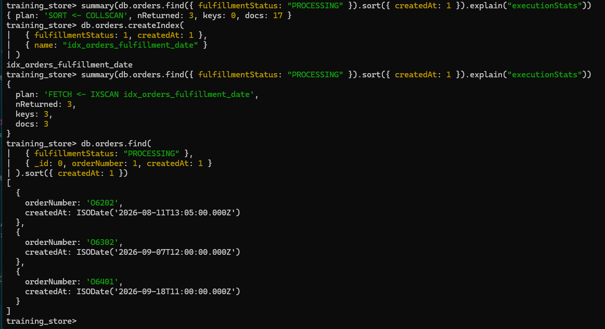

This is the in-slide exercise "Index the Fulfillment Queue".

---

### Step 5 — Multikey: tags = "wireless"

**Do this:**

```javascript
db.products.createIndex(
  { tags: 1 },
  { name: "idx_products_tags" }
)

db.products.find({ tags: "wireless" }).explain("executionStats")
db.products.find({ tags: "wireless" }, { _id: 0, sku: 1, name: 1, tags: 1 })

db.products.find({ tags: "technology" }, { _id: 0, sku: 1, name: 1 })
```

In the explain output, find the `IXSCAN` stage and read `isMultiKey` and `multiKeyPaths`.

Optional — count the keys the index holds:

```javascript
db.products.validate().keysPerIndex
```

**Expected result:**

- Plan: `FETCH` over `IXSCAN` on `idx_products_tags`, **2 keys · 2 docs · 2 returned**.
- `isMultiKey: true` and `multiKeyPaths: { tags: [ 'tags' ] }` — MongoDB marked the index multikey automatically because `tags` is an array. (`getIndexes()` does not show this flag; `explain()` does.)
- Wireless products: **P1001** Wireless Keyboard and **A410** Wireless Mouse.
- `technology` matches one book: **B300** MongoDB Fundamentals.
- `keysPerIndex`: `_id_: 13`, `sku_unique: 13`, `idx_products_tags: 26` — one key per array value across the 13 products.

The screenshot reads `isMultiKey` with a small `ixscan()` helper. `summary()` does not print that flag. `explain()` does.

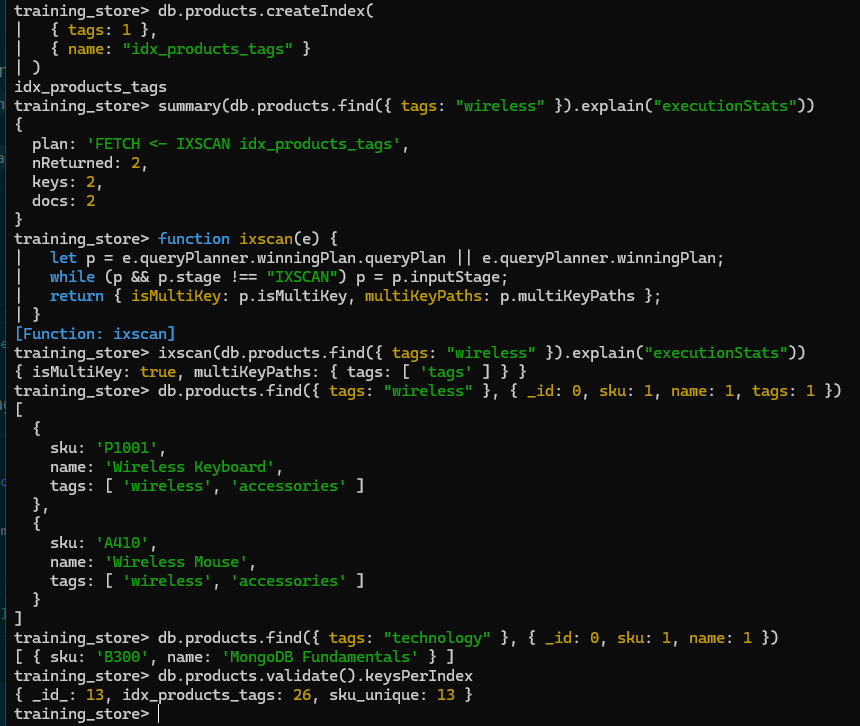

---

### Step 6 — Inventory every index

**Do this:**

```javascript
db.products.getIndexes()
db.customers.getIndexes()
db.orders.getIndexes()
db.reviews.getIndexes()
```

For every index except `_id_`, fill one row:

| Collection | Index | Key | Query or rule it supports | Sort? | Business rule? | Write cost | Redundant? |
| --- | --- | --- | --- | --- | --- | --- | --- |
| | | | | | | | |

**Expected result:** seven indexes besides `_id_`:

- Created by `load.js` (unique identity rules): `sku_unique` on products; `customerNumber_unique` and `email_unique` (key `contact.email`) on customers; `orderNumber_unique` on orders.
- Created by you: `idx_orders_customer_date` (Step 2), `idx_orders_fulfillment_date` (Step 4) and `idx_products_tags` (Step 5).
- `reviews` has only `_id_`.

None is redundant. **Do not drop the unique identity indexes.** Every order insert now maintains four indexes: `_id_`, `orderNumber_unique` and your two.

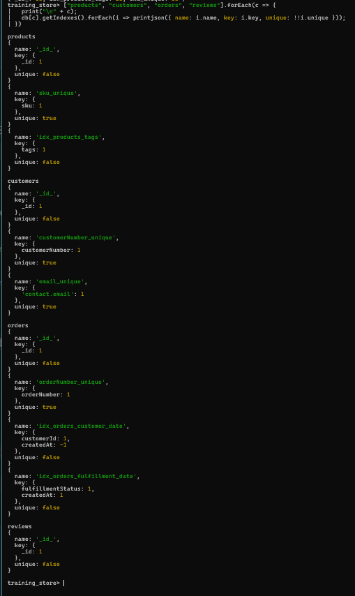

This is the end of the core lab. Keep your before-and-after numbers and the inventory — the Module 6 summary asks you to bring them to Module 7.

---

## Go further — Steps 7–13 (if time allows)

These steps fold in the extra Module 6 practice. They build on each other and on Steps 1–6, so run them in order in the same session. They also match slides in the deck: "Reading executionStats" (Step 7), "Unique Indexes" (Step 9), "Partial" and "TTL Indexes" (Step 10), "Proving Coverage" (Step 11) and "Index Usage Statistics" (Step 13).

### Step 7 — The catalog index and its prefixes

**Do this:** baseline first, then create the ESR index, then test two prefix queries.

```javascript
db.products.find({ category: "ACCESSORY", active: true })
  .sort({ price: 1 })
  .explain("executionStats")

db.products.createIndex(
  { category: 1, active: 1, price: 1 },
  { name: "idx_products_category_active_price" }
)

db.products.find({ category: "ACCESSORY", active: true })
  .sort({ price: 1 })
  .explain("executionStats")

db.products.find({ category: "ACCESSORY", active: true },
                 { _id: 0, sku: 1, name: 1, price: 1 })
  .sort({ price: 1 })

// Prefix tests
db.products.find({ category: "LAPTOP" }).explain("executionStats")
db.products.find({ active: true }).explain("executionStats")
```

Write one query this index does **not** serve well, with a one-line reason.

**Expected result:**

- Baseline: `SORT` over `COLLSCAN`, **0 keys · 13 docs · 5 returned**.
- After: `FETCH` over `IXSCAN` on `idx_products_category_active_price`, **5 keys · 5 docs · 5 returned**, no `SORT`. E: `category`, `active` · S: `price`.
- Results in order: **A410** Wireless Mouse 19.99, **A400** USB Hub 24.99, **P1001** Wireless Keyboard 49.99, **A500** Docking Station 249.99, then **XBAD** Legacy Cable Pack — its price is the string `"49.99"`, and strings sort after numbers.
- `category: "LAPTOP"` uses the leading prefix: `FETCH` over `IXSCAN`, 3 keys · 3 docs · 3 returned.
- `active: true` alone is not a prefix: `COLLSCAN`, 13 docs examined, 12 returned.
- Unsupported example: `find({ price: { $lt: 50 } })` skips `category` (not a prefix), or `sort({ name: 1 })` needs a `SORT` stage.

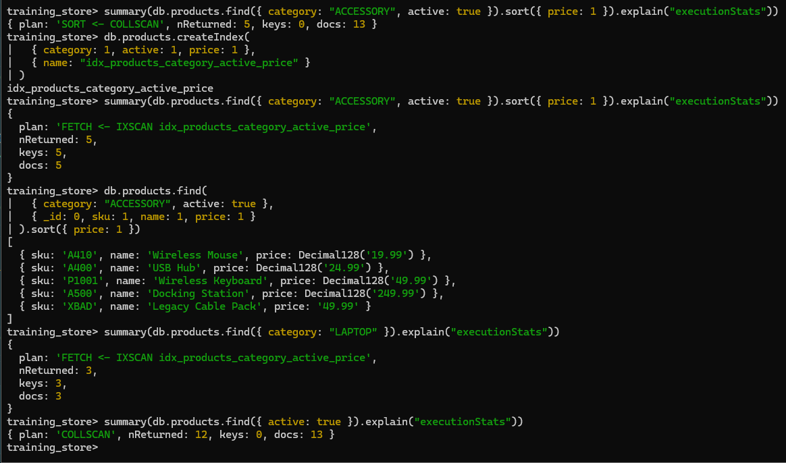

---

### Step 8 — A nested field and a date range

**Do this:** look up a customer by the nested email path, then add a date range to the history query.

```javascript
db.customers.find({ "contact.email": "aisha@example.com" }).explain("executionStats")

db.orders.find({
  customerId: cid,
  createdAt: { $gte: ISODate("2026-08-01T00:00:00Z") }
}).sort({ createdAt: -1 }).limit(10).explain("executionStats")
```

Optional — prove the field order matters. Create the reversed order, force it with `hint`, compare, then drop it:

```javascript
db.orders.createIndex(
  { createdAt: -1, customerId: 1 },
  { name: "idx_orders_created_customer" }
)
db.orders.find({
  customerId: cid,
  createdAt: { $gte: ISODate("2026-08-01T00:00:00Z") }
}).sort({ createdAt: -1 }).limit(10)
  .hint("idx_orders_created_customer")
  .explain("executionStats")

db.orders.dropIndex("idx_orders_created_customer")
```

**Expected result:**

- Email: `FETCH` over `IXSCAN` on **`email_unique`** — `load.js` already indexes `contact.email` (uniquely). **1 key · 1 doc · 1 returned.** On this server the stage is a single `EXPRESS_IXSCAN email_unique`. Same index, same counts. Don't create a second index on `contact.email` under another name: MongoDB rejects it with *Index already exists with a different name: email_unique*.
- Date range: `LIMIT` over `FETCH` over `IXSCAN` on `idx_orders_customer_date`, **4 keys · 4 docs · 4 returned** — O5001, O6306, O6301, O6201. `createdAt` is both the sort and the range, so it appears once in the index.
- Reversed order (optional): the scan walks every order created since 1 August, across all customers. On this server that was **15 keys** and **4 docs** to return the same 4. `dropIndex` printed `{ nIndexesWas: 5, ok: 1 }`. Evidence for `customerId` first.

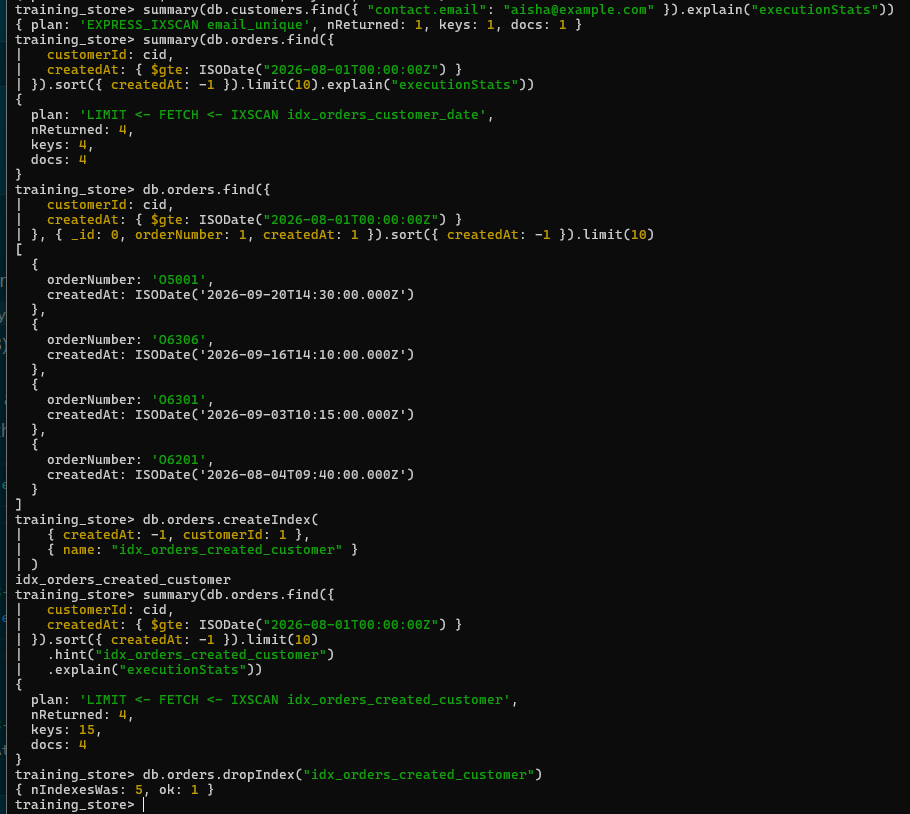

---

### Step 9 — Unique SKUs

**Do this:** confirm the identity rules `load.js` built, rebuild the SKU rule under the course name, and try a duplicate.

```javascript
db.customers.getIndexes().map(i => i.name)
db.orders.getIndexes().map(i => i.name)

db.products.dropIndex("sku_unique")
db.products.createIndex(
  { sku: 1 },
  { unique: true, name: "uq_products_sku" }
)

db.products.insertOne({
  sku: "L100",
  name: "Duplicate SKU test",
  category: "LAPTOP",
  price: Decimal128("1.00"),
  active: false,
  tags: ["temp"],
  createdAt: new Date()
})

db.products.countDocuments()
```

Then write, in two sentences, what you would do if a unique build failed because duplicates already existed.

**Expected result:**

- `customerNumber_unique` and `orderNumber_unique` already exist. Don't create `uq_customers_customer_number` or `uq_orders_order_number`: a second index on the same key under another name is rejected.
- `dropIndex` prints `{ nIndexesWas: 4, ok: 1 }` (`_id_`, `sku_unique`, `idx_products_tags`, `idx_products_category_active_price`); `createIndex` prints `uq_products_sku`. You must drop first — MongoDB won't hold two `{ sku: 1 }` indexes with different names.
- The insert fails: `MongoServerError: E11000 duplicate key error collection: training_store.products index: uq_products_sku dup key: { sku: "L100" }`. Nothing is written; `countDocuments()` is still **13**.
- Cleanup: find duplicates with `$group` on the key, `$sum: 1`, then `$match` a count above 1; merge or delete the extras, then build the unique index again.

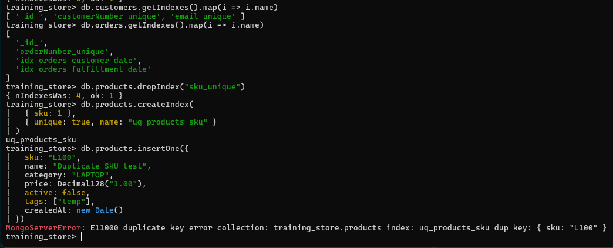

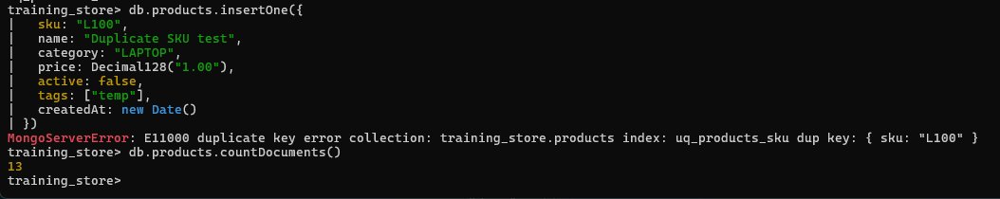

---

### Step 10 — Partial and TTL indexes

**Do this — partial:** index only active products, then compare a compatible and an incompatible query.

```javascript
db.products.createIndex(
  { category: 1, price: 1 },
  {
    name: "idx_active_products_category_price",
    partialFilterExpression: { active: true }
  }
)
db.products.validate().keysPerIndex

// Compatible: the filter includes active: true
db.products.find({ category: "LAPTOP", active: true,
                   price: { $lte: Decimal128("2000.00") } })
  .hint("idx_active_products_category_price")
  .explain("executionStats")

// Incompatible: no active: true, so L190 would be missing
db.products.find({ category: "LAPTOP",
                   price: { $lte: Decimal128("2000.00") } })
  .explain("executionStats")
db.products.find({ category: "LAPTOP",
                   price: { $lte: Decimal128("2000.00") } })
  .hint("idx_active_products_category_price")
```

**Do this — TTL:** a dedicated `sessions` collection, never `orders`.

```javascript
db.sessions.drop()
db.sessions.insertMany([
  { sessionId: "S1", user: "aisha",
    expiresAt: new Date(Date.now() + 60 * 60 * 1000) },
  { sessionId: "S-EXPIRED", user: "temp",
    expiresAt: new Date(Date.now() - 60 * 1000) }
])
db.sessions.createIndex(
  { expiresAt: 1 },
  { expireAfterSeconds: 0, name: "ttl_sessions_expires_at" }
)
db.sessions.getIndexes()
db.sessions.countDocuments()
```

Wait about 60 seconds, then:

```javascript
db.sessions.find({}, { _id: 0, sessionId: 1 })
```

**Expected result:**

- `keysPerIndex` shows `idx_active_products_category_price: 12` — every product except the inactive L190. On this server the rest of that object was `_id_` **13**, `idx_products_category_active_price` **13**, `idx_products_tags` **26**, and `uq_products_sku` **13**.
- Compatible query (hinted): `FETCH` over `IXSCAN` on the partial index, **2 keys · 2 docs · 2 returned** — L100 Business Laptop and L110 Ultrabook. Without the hint the planner may pick `idx_products_category_active_price` instead; both are valid for this filter.
- Incompatible query: the plan names **`idx_products_category_active_price`**, never the partial index, and returns **3** laptops including L190. On this server that scan examined **4 keys** and **3 docs**.
- On MongoDB 8.3.11 the hinted incompatible find was accepted. It returned only **L100** and **L110**, so inactive **L190** was missing from the answer. That is a wrong result: the partial index cannot serve a filter that does not include `active: true`. Older servers may reject the same hint with an error. Either way, use the unhinted query when the filter does not guarantee `active: true`.
- `sessions.drop()` printed `true` here because a `sessions` collection was already present. `getIndexes()` lists `ttl_sessions_expires_at` with `expireAfterSeconds: 0`.
- Right after the insert, `countDocuments()` is **2** if you count before the monitor runs. On this run **S-EXPIRED** was already gone, so the count was **1** and the find showed only **S1**. If S-EXPIRED is still there, wait and check again — expiry is asynchronous, never real-time.

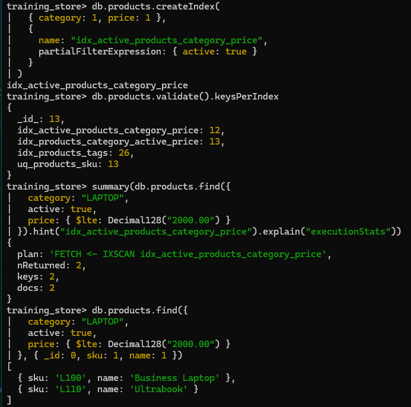

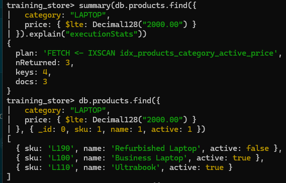

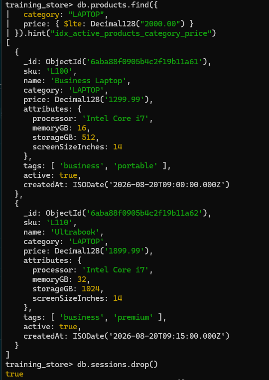

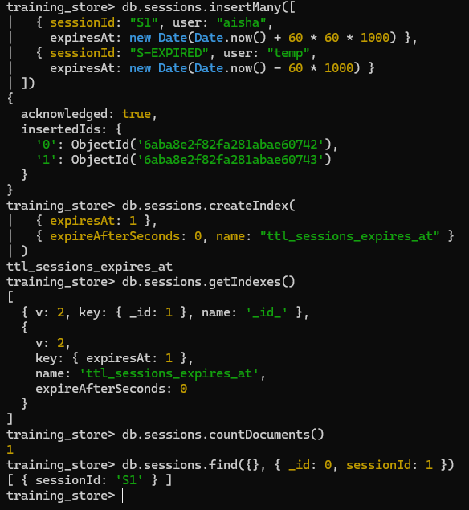

---

### Step 11 — A covered query

**Do this:**

```javascript
db.products.createIndex(
  { category: 1, price: 1, name: 1 },
  { name: "idx_products_category_price_name" }
)

// Covered
db.products.find({ category: "BOOK" }, { _id: 0, name: 1, price: 1 })
  .explain("executionStats")
db.products.find({ category: "BOOK" }, { _id: 0, name: 1, price: 1 })

// Not covered: _id comes back by default
db.products.find({ category: "BOOK" }, { name: 1, price: 1 })
  .explain("executionStats")

// Not covered: tags isn't in the index
db.products.find({ category: "BOOK" }, { _id: 0, name: 1, tags: 1 })
  .explain("executionStats")
```

Write one sentence: when is this catalog projection covered, and how do you confirm it?

**Expected result:**

- Covered: `PROJECTION_COVERED` over `IXSCAN` on `idx_products_category_price_name`, **2 keys · 0 docs · 2 returned** — no `FETCH`. The planner chose that index without a hint. Hinting it produced the same plan.
- Results in index order: **Query Cookbook** 39.99, then **MongoDB Fundamentals** 59.99.
- Both variants that are not covered gain a `FETCH`: `PROJECTION_SIMPLE` over `FETCH` over `IXSCAN` on `idx_products_category_active_price`, **2 keys · 2 docs · 2 returned**. One returns `_id` by default; the other returns `tags`. Neither field is in the covering index.
- Rule: filter fields indexed, returned fields indexed, `_id` excluded or indexed — confirmed with `explain()`, not by guessing. This tests your Exercise 6.2 answers.

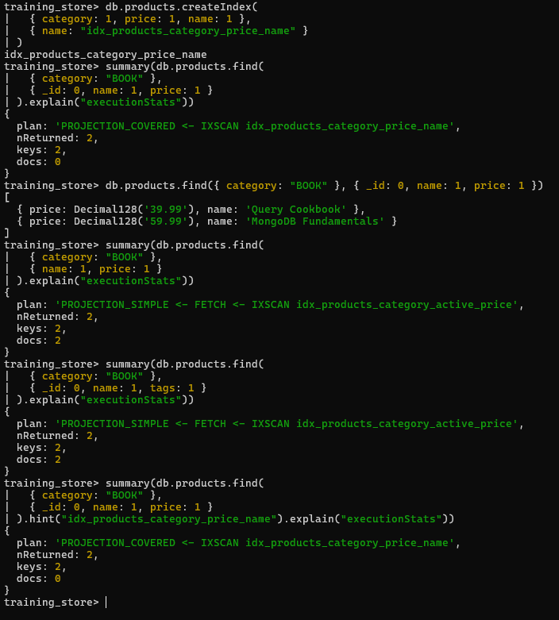

---

### Step 12 — Tune an aggregation

**Do this:** explain the pipeline, create a supporting index, explain again, then run it.

```javascript
var pipeline = [
  { $match: { paymentStatus: "PAID" } },
  { $sort: { createdAt: -1 } },
  { $group: {
      _id: "$fulfillmentStatus",
      revenue: { $sum: "$total" },
      orderCount: { $sum: 1 }
  } }
]

db.orders.explain("executionStats").aggregate(pipeline)

db.orders.createIndex(
  { paymentStatus: 1, createdAt: -1 },
  { name: "idx_orders_payment_created" }
)

db.orders.explain("executionStats").aggregate(pipeline)
db.orders.aggregate(pipeline)
```

Write which stage still can't be served by the index.

**Expected result:**

- Before: `GROUP` over `SORT` over `COLLSCAN`, **nReturned 4 · 0 keys · 17 docs**.
- After: `GROUP` over `FETCH` over `IXSCAN` on `idx_orders_payment_created`, **nReturned 4 · 13 keys · 13 docs**. The `SORT` is gone. `GROUP` still processes all 13 matched documents.
- Where to look: on MongoDB 7.0 and later the plan is usually under `queryPlanner.winningPlan.queryPlan` with a `GROUP` stage on top; on older versions it is under `stages[0].$cursor`. The screenshot uses an `aggSummary()` reader because `summary()` is for `find()` only.
- Result (four groups; their order may vary). On this run the order was DELIVERED, SHIPPED, NEW, PROCESSING, and each revenue value is a Decimal128:

| `_id` | revenue | orderCount |
| --- | --- | --- |
| SHIPPED | 3809.48 | 6 |
| DELIVERED | 2788.42 | 4 |
| PROCESSING | 2448.77 | 2 |
| NEW | 71.77 | 1 |

- An index narrows and orders the input; it doesn't remove grouping work.

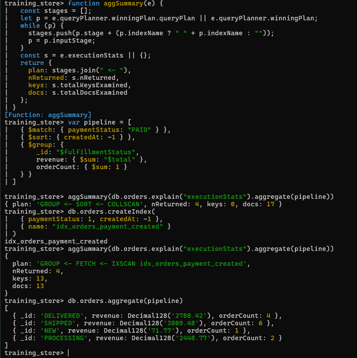

---

### Step 13 — Audit: hide, test, recommend

**Do this:** list what you built, read the usage counters, hide one overlapping candidate, test, and unhide.

```javascript
db.getCollectionNames()
db.products.getIndexes().map(i => i.name)
db.products.aggregate([{ $indexStats: {} }])
  .map(s => ({ name: s.name, ops: s.accesses.ops }))

db.products.hideIndex("idx_products_category_active_price")
db.products.find({ category: "ACCESSORY" }).explain("queryPlanner")
db.products.unhideIndex("idx_products_category_active_price")
```

Then, for the hidden candidate, write **retain**, **redesign** or **remove**, with one sentence of evidence. Do **not** drop anything in this lab.

**Expected result:**

- Products now has six indexes: `_id_`, `idx_products_tags`, `idx_products_category_active_price`, `uq_products_sku`, `idx_active_products_category_price` and `idx_products_category_price_name`. `sku_unique` is gone — Step 9 replaced it with `uq_products_sku`.
- `getCollectionNames()` on this database also lists `environment_check` (Lab 1), `sessions` (Step 10), and `validated_products` from an earlier lab. This lab does not use `validated_products`.
- Three indexes lead with `category`: an overlapping prefix.
- `$indexStats` counters count since `mongod` started, per server. On this run: `idx_products_category_active_price` **3**, `idx_products_tags` **2**, `idx_active_products_category_price` **1**, `idx_products_category_price_name` **1**, `_id_` **0**, `uq_products_sku` **0**.
- While hidden, the plan for `category: "ACCESSORY"` was `FETCH` over `IXSCAN` on `idx_products_category_price_name` (the partial index can't serve a query without `active: true`). `unhideIndex` printed `{ hidden_old: true, hidden_new: false, ok: 1 }`. Every index then reported `hidden: false`, with no rebuild.
- Never hide `_id_` (MongoDB refuses) or a unique or TTL rule; a hidden unique index still rejects duplicates anyway.
- Recommendation from this run: **retain** `idx_products_category_active_price`. Step 7 used it for the accessory browse with no `SORT`. Review later whether the partial index and the covering index both earn their write cost.

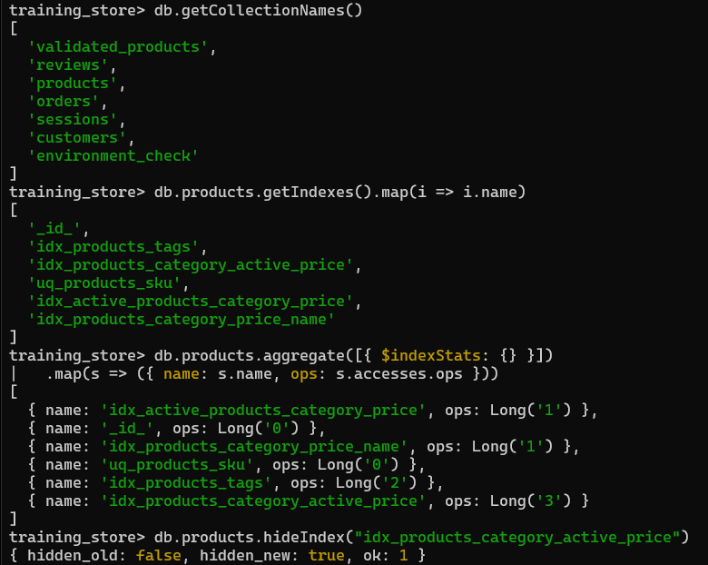

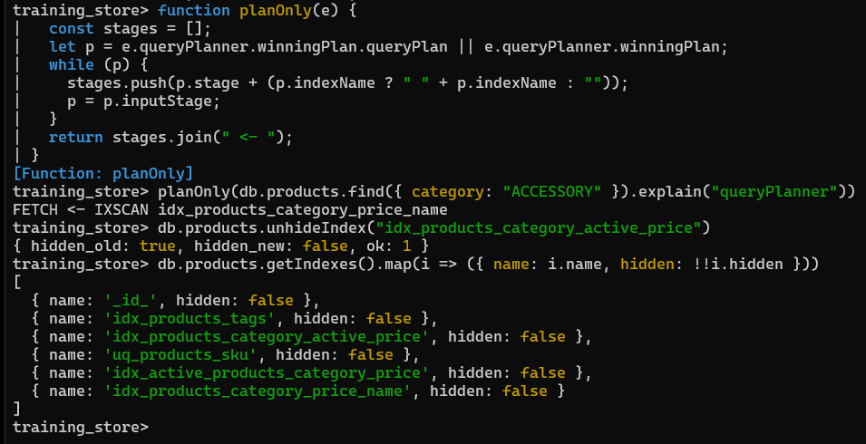

---

## Success criteria

Core:

- [ ] `load.js` reloaded; counts 13 products · 6 customers · 17 orders · 6 reviews
- [ ] Baseline `explain` recorded **before** creating `idx_orders_customer_date` (`SORT` + `COLLSCAN`, 17 docs)
- [ ] History query uses `cid` from C101's `customerNumber`, not a copied ObjectId
- [ ] After the index: `IXSCAN`, 5 keys, 5 docs, no `SORT`
- [ ] The PROCESSING queue needed a different leading field (`idx_orders_fulfillment_date`, 3 orders)
- [ ] The tags query used a multikey index (`isMultiKey: true`)
- [ ] The inventory names a purpose for every index; no unique identity index was dropped

Go further:

- [ ] Catalog index: 5 : 5 : 5 and a prefix success and failure noted
- [ ] Duplicate SKU rejected with E11000 on `uq_products_sku`
- [ ] Partial index holds 12 keys; compatible versus incompatible query shown
- [ ] `ttl_sessions_expires_at` exists on `sessions`; asynchronous expiry stated
- [ ] Covered query shows `totalDocsExamined: 0`
- [ ] `idx_orders_payment_created` serves the pipeline's `$match` + `$sort`; `$group` named as remaining work
- [ ] One index hidden and unhidden, with a written recommendation

---

## Troubleshooting

| Symptom | What to check |
| --- | --- |
| Counts are not 13 / 6 / 17 / 6 | Earlier writes remain. Re-run `load.js` from PowerShell (Before you start). Reloading also removes the indexes you created — start again at Step 1. |
| `load.js` "file not found" | Run it from the repository root, in PowerShell. Inside `mongosh`, use `load("datasets/training_store/load.js")` instead. |
| `nReturned: 0` in Step 1 | `cid` is not set, or you pasted an ObjectId from a slide. Re-run `var cid = db.customers.findOne({ customerNumber: "C101" })._id`. |
| `ReferenceError: cid is not defined` | A new `mongosh` session. Run `use training_store` and the `var cid = …` line again. |
| Step 1 shows `IXSCAN` on `_id_` with a `FETCH` and a `SORT` | Possible on some versions. Either way the history index is missing — record it as the baseline. |
| Step 1 already shows `IXSCAN idx_orders_customer_date` | The index survived from an earlier run. Reload with `load.js` to get a real baseline. |
| *Index already exists with a different name* | The same key is already indexed under another name (for example `email_unique`, `sku_unique`, or an old `idx_orders_customer_created`). Use the existing index, or drop it by name first. |
| *An existing index has the same name as the requested index* / different options | You re-ran a `createIndex` with changed options. `dropIndex("<name>")`, then create it again. |
| I can't find `winningPlan.inputStage` | On MongoDB 7.0+ the stages may sit under `winningPlan.queryPlan`. The optional `summary()` helper handles both. |
| The plan is one `EXPRESS_IXSCAN` stage | MongoDB 8.0's fast path for an equality on `_id` or a unique index. It is still an index scan; read the index name and the counts. |
| `dropIndex("sku_unique")`: *index not found* | Already dropped in an earlier run of Step 9. Continue with `createIndex`. |
| Step 10 hint returns two laptops, or errors | The partial index omits inactive products. The unhinted query is the one that must return L190. On MongoDB 8.3 the hint can succeed and drop L190. An error on the hint is also a valid result on older servers. |
| S-EXPIRED is still in `sessions` | The TTL monitor runs about once a minute. Wait and check again. |
| `hideIndex` on `_id_` fails | By design. Hide a non-unique helper index instead. |
| Step 11 plan names another index and shows a `FETCH` | Another category-leading index won. Add `.hint("idx_products_category_price_name")` before `.explain(…)`. |

---

## Clean up

Nothing to clean up for Module 7. If you want a fresh start, reload `load.js`; it drops the lab indexes on the four main collections. Drop the lab's own collection with `db.sessions.drop()` if the instructor asks.

---

## Optional stretch (only if you finished early)

The integrated tuning challenge — tune two pages end to end:

1. **Catalog page:** active ACCESSORY products, price ≤ 100, sorted by price, returning `name`, `price` and `category`, `_id` off. Is it covered by any index you built? Why not?
2. **History page:** C101, PAID, newest first, `createdAt` ≥ 2026-08-01, limit 20. Choose between `{ customerId: 1, createdAt: -1 }` (already there) and `{ customerId: 1, paymentStatus: 1, createdAt: -1 }`, and justify it with explain numbers.
3. Write the indexes you would keep for these two pages, their write and storage impact, and one index you would **not** add.
